# 350 种排版 · 流动图鉴

把 350 张排版参考卡片变成一个可以自由浏览的桌面端瀑布流：顺着画面寻找灵感，悬停查看线索，点击从原位展开，再复制感兴趣的设计描述继续创作。

这是 [jinhanbuilds](https://github.com/jinhanbuilds) 基于 [nevertoday/350-layout-compositions](https://github.com/nevertoday/350-layout-compositions) 制作的 Fork。原项目提供排版图片与分类资料；本 Fork 的主要贡献是交互浏览页面、图片对应的设计描述与一键复制体验。

**[下载并体验页面](https://github.com/jinhanbuilds/350-layout-compositions/archive/refs/heads/main.zip)** · [查看页面源码](index.html) · [浏览原项目](https://github.com/nevertoday/350-layout-compositions)

下载整个仓库并解压，使用桌面浏览器打开根目录的 `index.html`，即可浏览全部卡片，无需安装依赖或启动服务。图片文件夹需要与页面一起保留。GitHub 上的「页面源码」链接展示代码，交互体验请打开下载后的本地文件。

## 这个 Fork 增加了什么

- **自由浏览**：350 张卡片以瀑布流呈现，支持搜索和 8 个一级分类筛选。
- **悬停看线索**：鼠标移到卡片上，显示名称、分类与主题，帮助快速判断是否感兴趣。
- **原位展开**：点击后卡片从当前位置展开为悬浮详情，阅读高清图与文字说明；点击背景或按 `Esc` 回到浏览位置。
- **复制设计描述**：详情中展示可复用的设计提示词，按钮复制的内容与可见文本完全一致。

页面面向桌面端浏览，展开与收回使用连贯过渡，并支持系统的减少动态效果设置。

## 页面预览

**浏览总览** · 从图片出发寻找感兴趣的构图与版式。

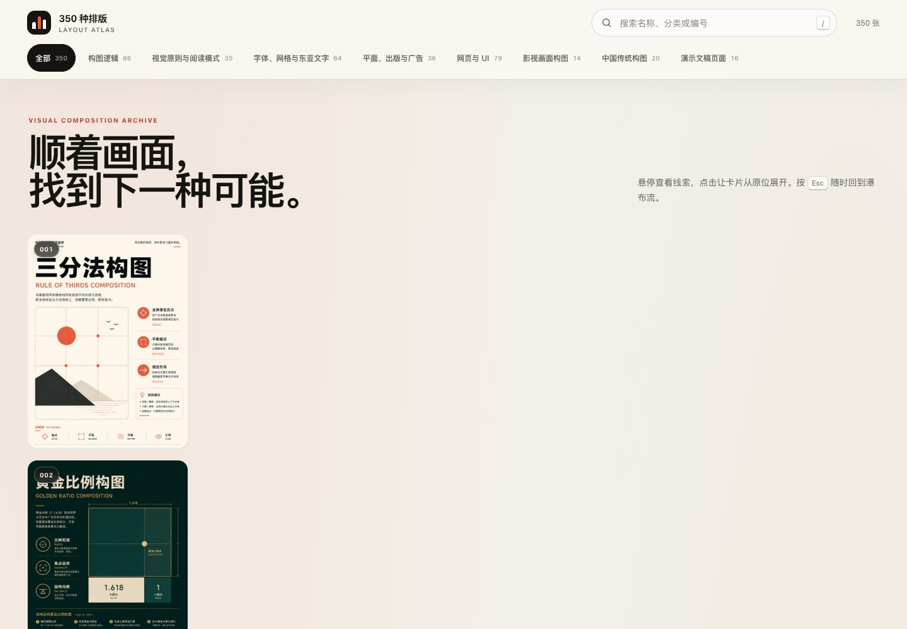

**悬停查看** · 不离开瀑布流，就能看到卡片的名称和分类线索。

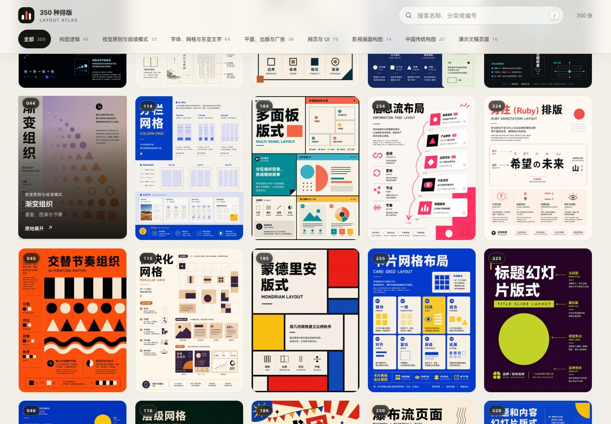

**展开与复制** · 在同一个浮层中查看高清参考图、设计描述和复制按钮。


## 图片与文字来源

图片与原始分类资料来自上游项目，保留原作者署名及仓库的 [CC BY 4.0 许可证](LICENSE)。本 Fork 新增网页界面，并按图片中可见的标题校正网页展示信息；原图片文件名和原始目录继续保留。

页面中的「图片提示词」是围绕对应设计概念整理的可复用描述，并非原作者生成图片时使用的原始提示词，也不保证复现示例图。源图片包含少量同主题卡片，因此网页保留全部 350 张图片，允许主题重复。

以下保留原项目的分类图鉴、下载入口与说明，方便继续查阅。

## 浏览新版

**[打开 350 种排版完整分类图鉴 →](docs/350/README.md)**　·　[下载全部图片](https://github.com/nevertoday/350-layout-compositions/releases/latest/download/350-layout-compositions-images.zip)　·　[搜索数据目录](v2/catalog.csv)

### 一级分类 · 像 Tab 一样切换

<p align="center">
  <a href="docs/350/01-composition-logic.md"><kbd>01 构图逻辑 · 86</kbd></a>
  <a href="docs/350/02-visual-principles.md"><kbd>02 视觉原则 · 45</kbd></a>
  <a href="docs/350/03-editorial-advertising.md"><kbd>03 出版广告 · 36</kbd></a>
  <a href="docs/350/04-type-grid-cjk.md"><kbd>04 字体网格 · 54</kbd></a>
</p>

<p align="center">
  <a href="docs/350/05-web-ui.md"><kbd>05 网页 UI · 79</kbd></a>
  <a href="docs/350/06-film-frame.md"><kbd>06 影视画面 · 14</kbd></a>
  <a href="docs/350/07-chinese-composition.md"><kbd>07 中国传统 · 20</kbd></a>
  <a href="docs/350/08-presentation.md"><kbd>08 演示文稿 · 16</kbd></a>
</p>

<!-- default-gallery:start -->
## 默认展示 · 构图逻辑 86 种

进入项目即可浏览全部 86 种构图逻辑；点击缩略图打开 1086 × 1448 高清 PNG。

**快速定位：** [经典法则与空间留白](#default-classic-rules) · [重心、线条与轴线](#default-balance-lines-axes) · [字母形与曲线](#default-letter-curves) · [几何形与放射结构](#default-geometry-radial) · [阵列、层叠与组群](#default-pattern-grouping) · [空间层次与投影](#default-depth-projection) · [视点、景深与空间感](#default-viewpoint-focus)

<a id="default-classic-rules"></a>

### 经典法则与空间留白 · 15 种

比例、视线、运动空间、负空间与框景。 `001–015`

| <a href="v2/images/01-composition-logic/001-三分法构图.png">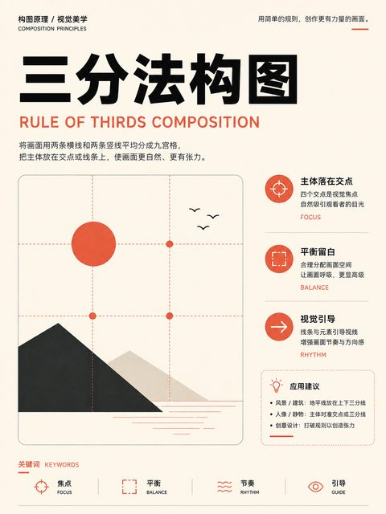</a> | <a href="v2/images/01-composition-logic/002-黄金比例构图.png"></a> | <a href="v2/images/01-composition-logic/003-黄金螺旋构图.png">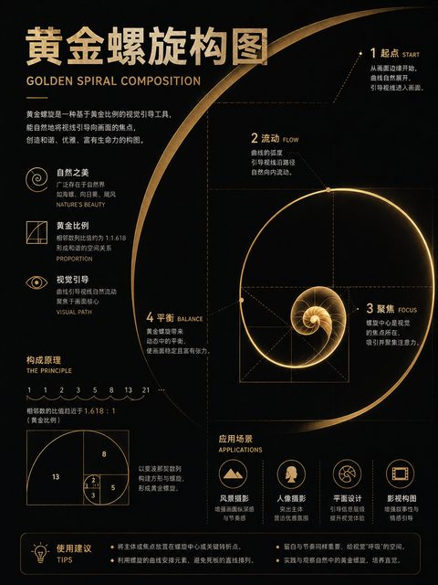</a> | <a href="v2/images/01-composition-logic/004-黄金三角构图.png">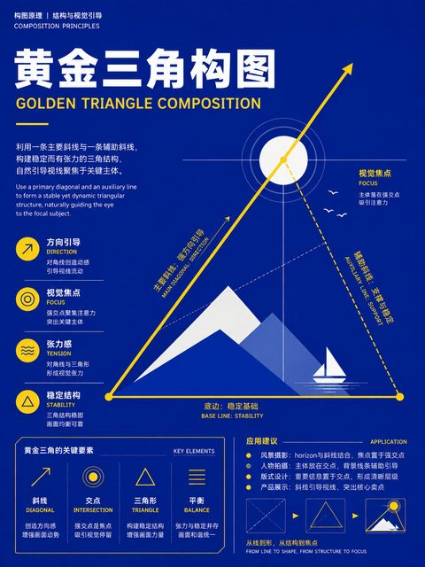</a> |
| :---: | :---: | :---: | :---: |
| **001**<br>三分法构图 | **002**<br>黄金比例构图 | **003**<br>黄金螺旋构图 | **004**<br>黄金三角构图 |

| <a href="v2/images/01-composition-logic/005-对角线法构图.png">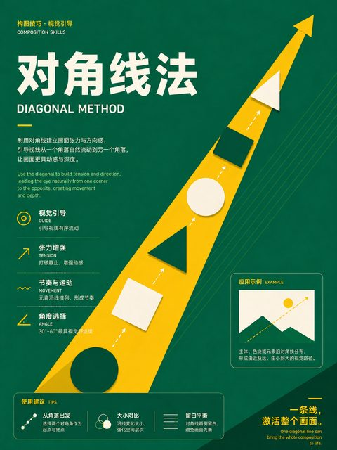</a> | <a href="v2/images/01-composition-logic/006-矩形折入法构图.png"></a> | <a href="v2/images/01-composition-logic/007-奇数法则构图.png">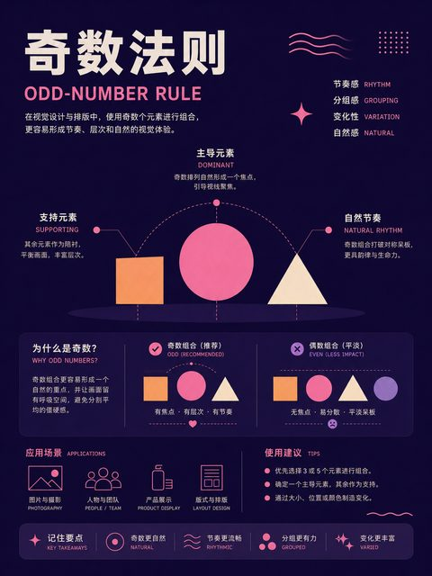</a> | <a href="v2/images/01-composition-logic/008-空间法则构图.png"></a> |
| :---: | :---: | :---: | :---: |
| **005**<br>对角线法构图 | **006**<br>矩形折入法构图 | **007**<br>奇数法则构图 | **008**<br>空间法则构图 |

| <a href="v2/images/01-composition-logic/009-视线空间构图.png"></a> | <a href="v2/images/01-composition-logic/010-运动空间构图.png"></a> | <a href="v2/images/01-composition-logic/011-头部空间构图.png">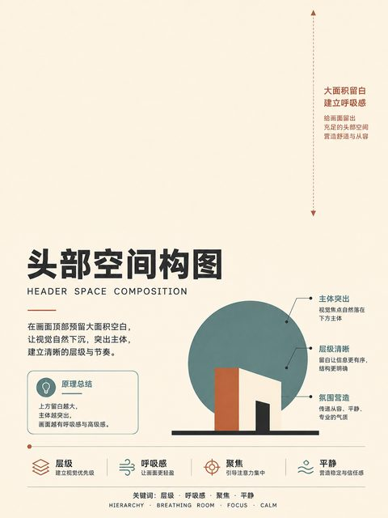</a> | <a href="v2/images/01-composition-logic/012-填满画面构图.png"></a> |
| :---: | :---: | :---: | :---: |
| **009**<br>视线空间构图 | **010**<br>运动空间构图 | **011**<br>头部空间构图 | **012**<br>填满画面构图 |

| <a href="v2/images/01-composition-logic/013-负空间构图.png"></a> | <a href="v2/images/01-composition-logic/014-框中框构图.png">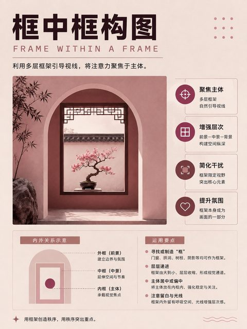</a> | <a href="v2/images/01-composition-logic/015-引导线构图.png">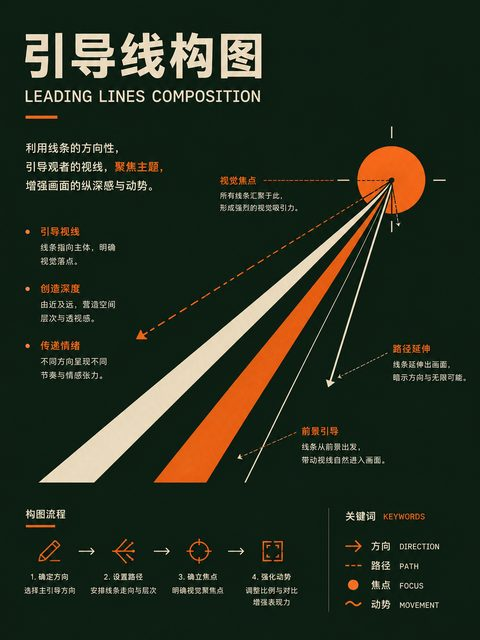</a> | 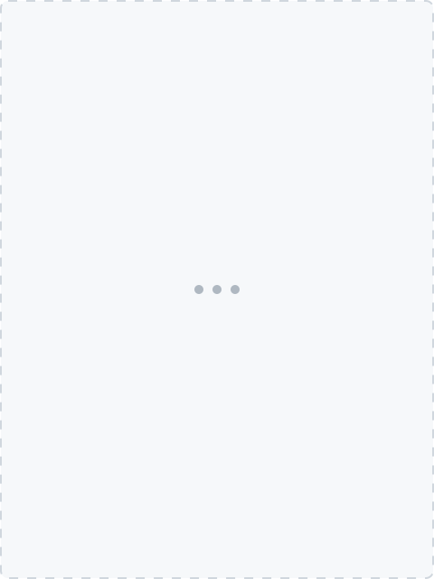 |
| :---: | :---: | :---: | :---: |
| **013**<br>负空间构图 | **014**<br>框中框构图 | **015**<br>引导线构图 | &nbsp; |

<a id="default-balance-lines-axes"></a>

### 重心、线条与轴线 · 15 种

居中、对称、方向线、交叉线与轴线组织。 `016–030`

| <a href="v2/images/01-composition-logic/016-居中构图.png">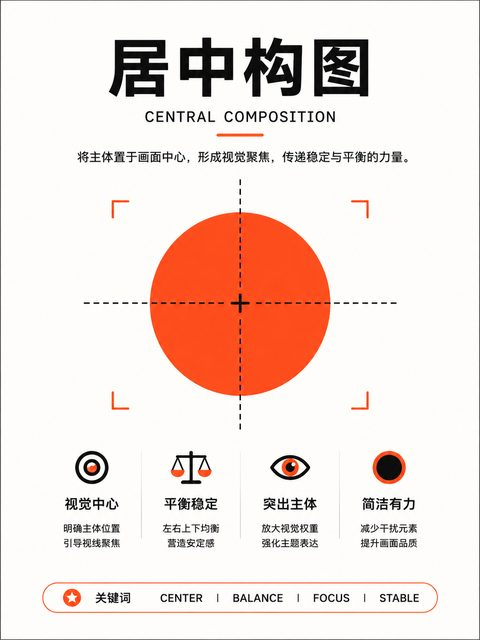</a> | <a href="v2/images/01-composition-logic/017-偏心构图.png"></a> | <a href="v2/images/01-composition-logic/018-对称构图.png">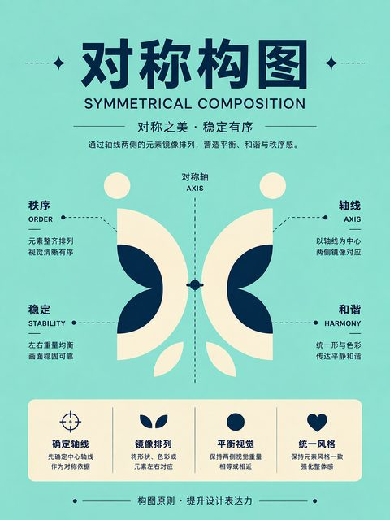</a> | <a href="v2/images/01-composition-logic/019-非对称构图.png"></a> |
| :---: | :---: | :---: | :---: |
| **016**<br>居中构图 | **017**<br>偏心构图 | **018**<br>对称构图 | **019**<br>非对称构图 |

| <a href="v2/images/01-composition-logic/020-镜像构图.png"></a> | <a href="v2/images/01-composition-logic/021-水平构图.png"></a> | <a href="v2/images/01-composition-logic/022-垂直构图.png"></a> | <a href="v2/images/01-composition-logic/023-对角线构图.png">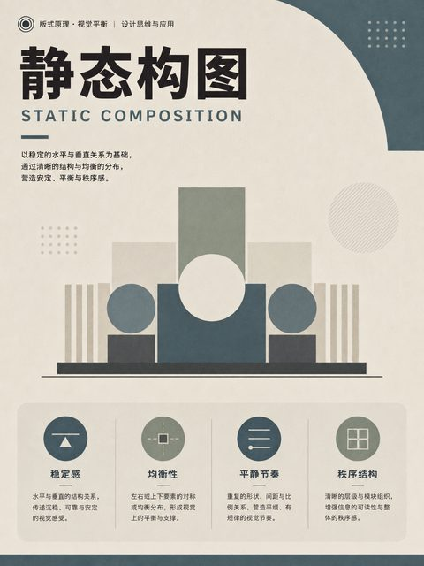</a> |
| :---: | :---: | :---: | :---: |
| **020**<br>镜像构图 | **021**<br>水平构图 | **022**<br>垂直构图 | **023**<br>对角线构图 |

| <a href="v2/images/01-composition-logic/024-平行线构图.png">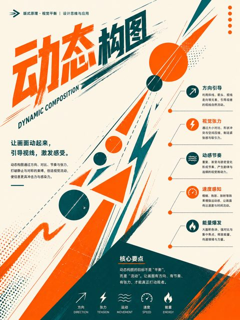</a> | <a href="v2/images/01-composition-logic/025-汇聚线构图.png">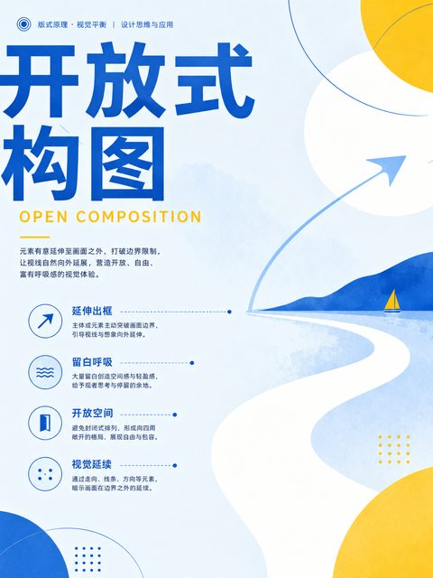</a> | <a href="v2/images/01-composition-logic/026-交叉线构图.png">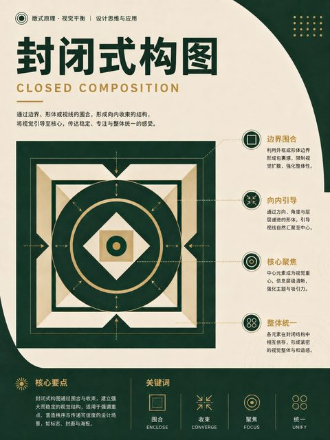</a> | <a href="v2/images/01-composition-logic/027-中轴构图.png">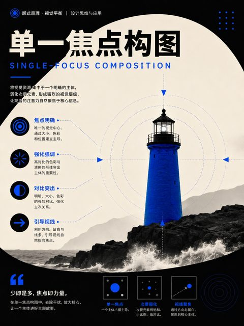</a> |
| :---: | :---: | :---: | :---: |
| **024**<br>平行线构图 | **025**<br>汇聚线构图 | **026**<br>交叉线构图 | **027**<br>中轴构图 |

| <a href="v2/images/01-composition-logic/028-偏轴构图.png">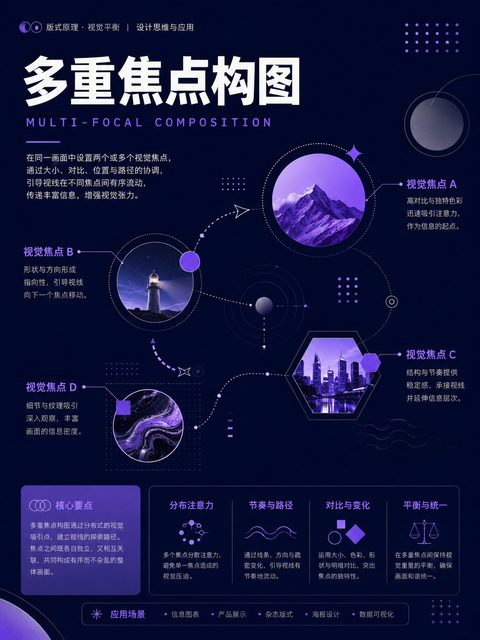</a> | <a href="v2/images/01-composition-logic/029-双轴构图.png"></a> | <a href="v2/images/01-composition-logic/030-十字构图.png">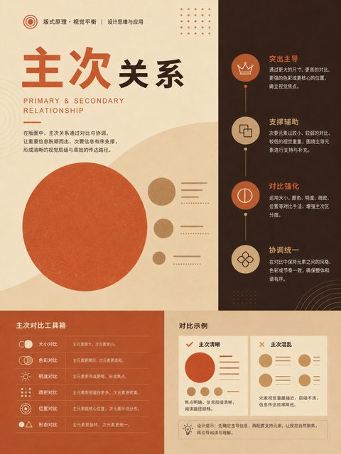</a> |  |
| :---: | :---: | :---: | :---: |
| **028**<br>偏轴构图 | **029**<br>双轴构图 | **030**<br>十字构图 | &nbsp; |

<a id="default-letter-curves"></a>

### 字母形与曲线 · 10 种

X、T、L、V、Z、C、S 形及曲线节奏。 `031–040`

| <a href="v2/images/01-composition-logic/031-X 形构图.png"></a> | <a href="v2/images/01-composition-logic/032-T 形构图.png"></a> | <a href="v2/images/01-composition-logic/033-L 形构图.png"></a> | <a href="v2/images/01-composition-logic/034-V 形构图.png"></a> |
| :---: | :---: | :---: | :---: |
| **031**<br>X 形构图 | **032**<br>T 形构图 | **033**<br>L 形构图 | **034**<br>V 形构图 |

| <a href="v2/images/01-composition-logic/035-Z 形构图.png"></a> | <a href="v2/images/01-composition-logic/036-C 形构图.png"></a> | <a href="v2/images/01-composition-logic/037-S 形构图.png"></a> | <a href="v2/images/01-composition-logic/038-曲线构图.png">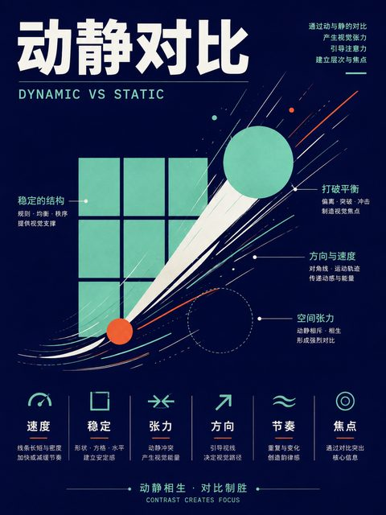</a> |
| :---: | :---: | :---: | :---: |
| **035**<br>Z 形构图 | **036**<br>C 形构图 | **037**<br>S 形构图 | **038**<br>曲线构图 |

| <a href="v2/images/01-composition-logic/039-波浪形构图.png">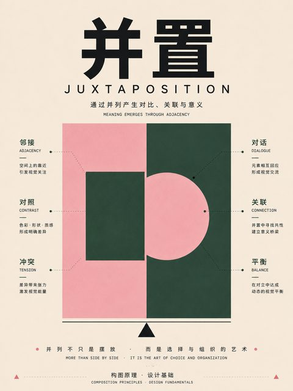</a> | <a href="v2/images/01-composition-logic/040-锯齿形构图.png">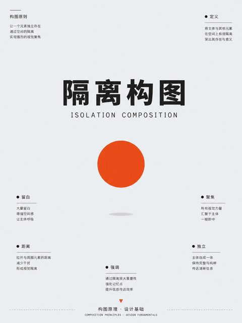</a> |  |  |
| :---: | :---: | :---: | :---: |
| **039**<br>波浪形构图 | **040**<br>锯齿形构图 | &nbsp; | &nbsp; |

<a id="default-geometry-radial"></a>

### 几何形与放射结构 · 16 种

三角、矩形、圆形、螺旋、向心与离心结构。 `041–056`

| <a href="v2/images/01-composition-logic/041-三角构图.png"></a> | <a href="v2/images/01-composition-logic/042-金字塔构图.png"></a> | <a href="v2/images/01-composition-logic/043-倒三角构图.png">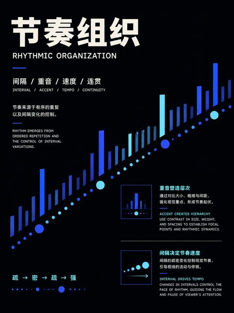</a> | <a href="v2/images/01-composition-logic/044-菱形构图.png"></a> |
| :---: | :---: | :---: | :---: |
| **041**<br>三角构图 | **042**<br>金字塔构图 | **043**<br>倒三角构图 | **044**<br>菱形构图 |

| <a href="v2/images/01-composition-logic/045-方形构图.png"></a> | <a href="v2/images/01-composition-logic/046-矩形构图.png">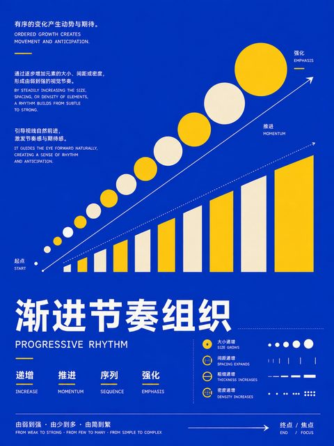</a> | <a href="v2/images/01-composition-logic/047-圆形构图.png"></a> | <a href="v2/images/01-composition-logic/048-椭圆构图.png">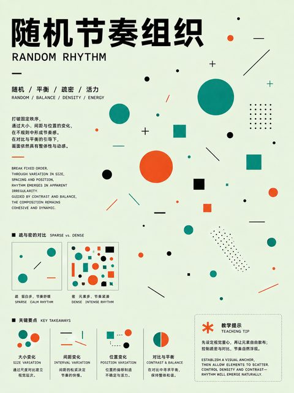</a> |
| :---: | :---: | :---: | :---: |
| **045**<br>方形构图 | **046**<br>矩形构图 | **047**<br>圆形构图 | **048**<br>椭圆构图 |

| <a href="v2/images/01-composition-logic/049-弧形构图.png"></a> | <a href="v2/images/01-composition-logic/050-环形构图.png">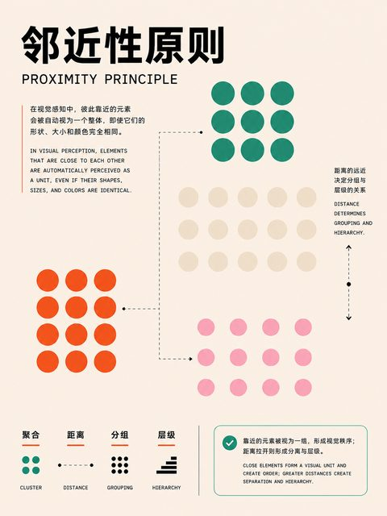</a> | <a href="v2/images/01-composition-logic/051-螺旋构图.png"></a> | <a href="v2/images/01-composition-logic/052-放射式构图.png">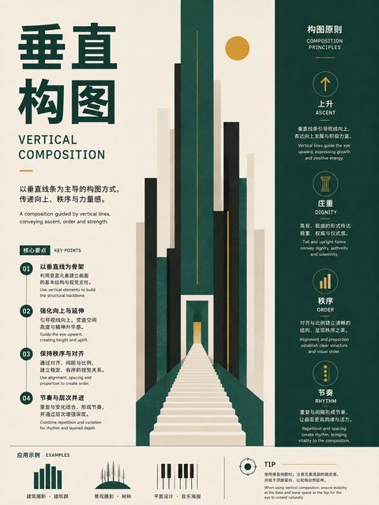</a> |
| :---: | :---: | :---: | :---: |
| **049**<br>弧形构图 | **050**<br>环形构图 | **051**<br>螺旋构图 | **052**<br>放射式构图 |

| <a href="v2/images/01-composition-logic/053-向心式构图.png">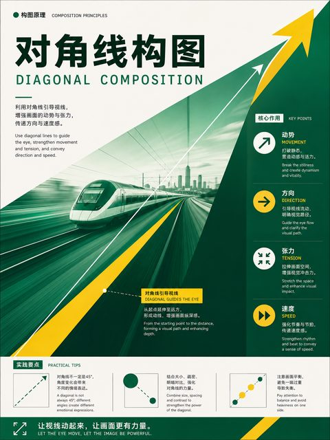</a> | <a href="v2/images/01-composition-logic/054-离心式构图.png"></a> | <a href="v2/images/01-composition-logic/055-同心式构图.png">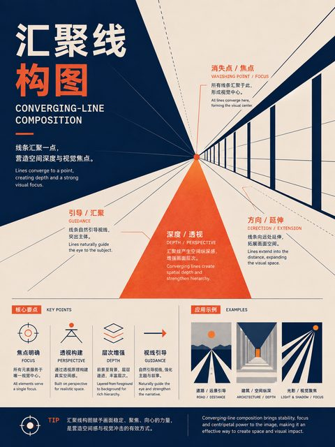</a> | <a href="v2/images/01-composition-logic/056-四象限构图.png"></a> |
| :---: | :---: | :---: | :---: |
| **053**<br>向心式构图 | **054**<br>离心式构图 | **055**<br>同心式构图 | **056**<br>四象限构图 |

<a id="default-pattern-grouping"></a>

### 阵列、层叠与组群 · 8 种

棋盘、阶梯、级联、聚类、分支和网络。 `057–064`

| <a href="v2/images/01-composition-logic/057-棋盘构图.png"></a> | <a href="v2/images/01-composition-logic/058-阶梯构图.png">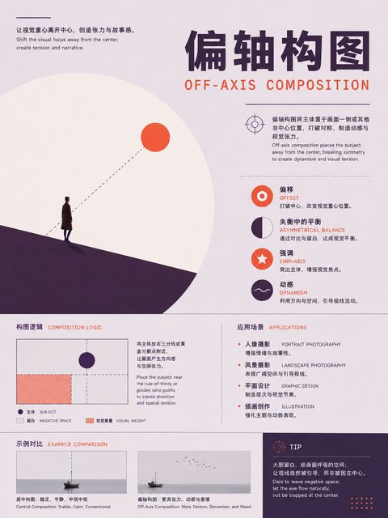</a> | <a href="v2/images/01-composition-logic/059-层叠构图.png"></a> | <a href="v2/images/01-composition-logic/060-级联构图.png"></a> |
| :---: | :---: | :---: | :---: |
| **057**<br>棋盘构图 | **058**<br>阶梯构图 | **059**<br>层叠构图 | **060**<br>级联构图 |

| <a href="v2/images/01-composition-logic/061-聚类构图.png"></a> | <a href="v2/images/01-composition-logic/062-分散构图.png"></a> | <a href="v2/images/01-composition-logic/063-分支构图.png"></a> | <a href="v2/images/01-composition-logic/064-网络构图.png">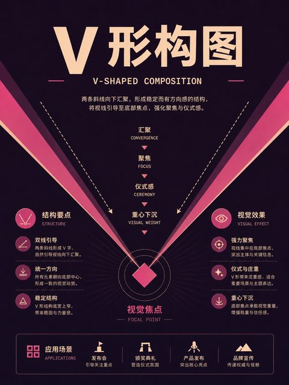</a> |
| :---: | :---: | :---: | :---: |
| **061**<br>聚类构图 | **062**<br>分散构图 | **063**<br>分支构图 | **064**<br>网络构图 |

<a id="default-depth-projection"></a>

### 空间层次与投影 · 12 种

前中后景、尺度递减、线性透视和轴测投影。 `065–076`

| <a href="v2/images/01-composition-logic/065-前中后景构图.png">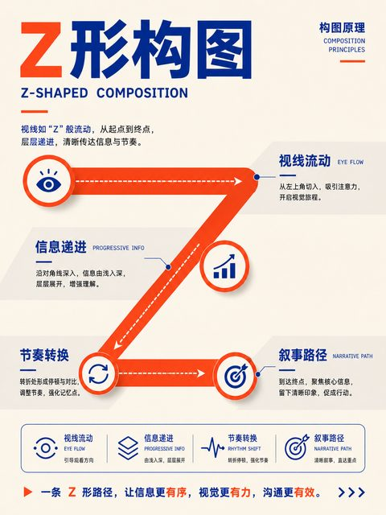</a> | <a href="v2/images/01-composition-logic/066-前景框架构图.png">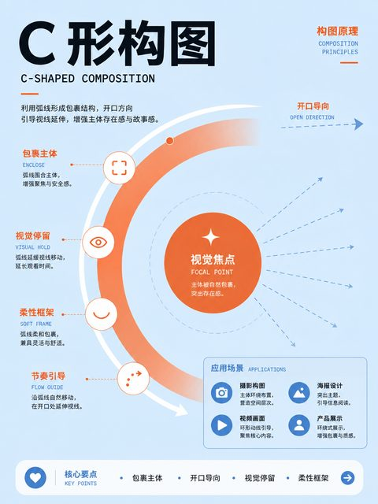</a> | <a href="v2/images/01-composition-logic/067-重叠空间构图.png"></a> | <a href="v2/images/01-composition-logic/068-尺度递减构图.png">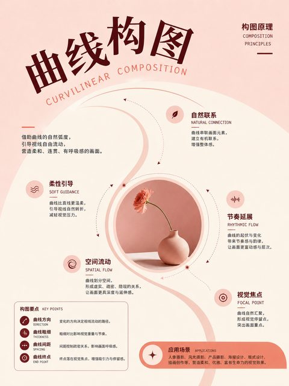</a> |
| :---: | :---: | :---: | :---: |
| **065**<br>前中后景构图 | **066**<br>前景框架构图 | **067**<br>重叠空间构图 | **068**<br>尺度递减构图 |

| <a href="v2/images/01-composition-logic/069-线性透视.png">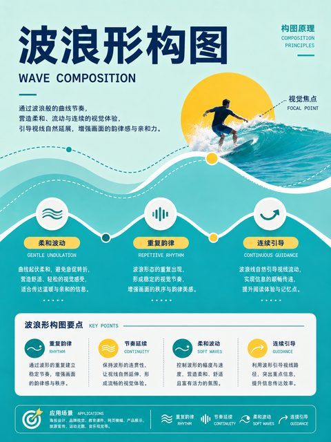</a> | <a href="v2/images/01-composition-logic/070-一点透视.png">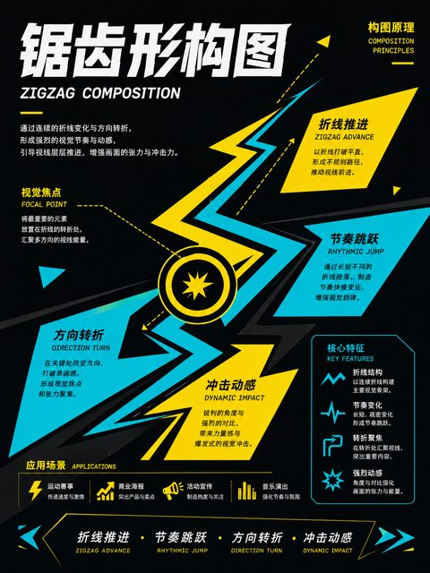</a> | <a href="v2/images/01-composition-logic/071-两点透视.png"></a> | <a href="v2/images/01-composition-logic/072-三点透视.png">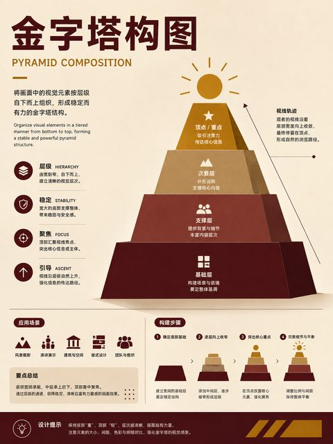</a> |
| :---: | :---: | :---: | :---: |
| **069**<br>线性透视 | **070**<br>一点透视 | **071**<br>两点透视 | **072**<br>三点透视 |

| <a href="v2/images/01-composition-logic/073-平行透视构图.png">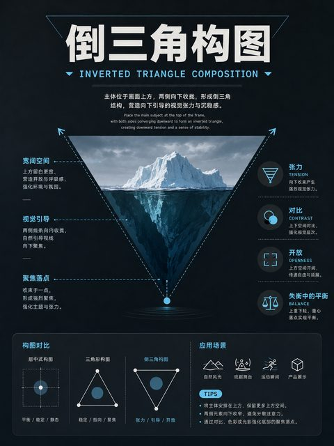</a> | <a href="v2/images/01-composition-logic/074-斜投影构图.png">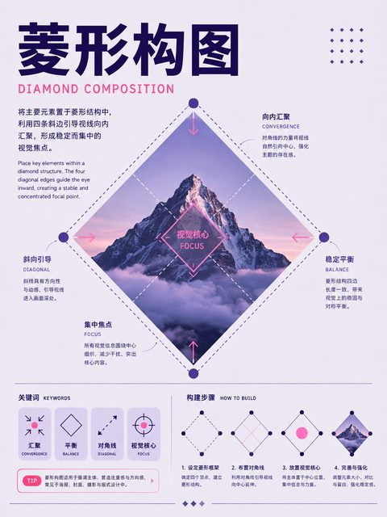</a> | <a href="v2/images/01-composition-logic/075-等距构图.png"></a> | <a href="v2/images/01-composition-logic/076-轴测构图.png">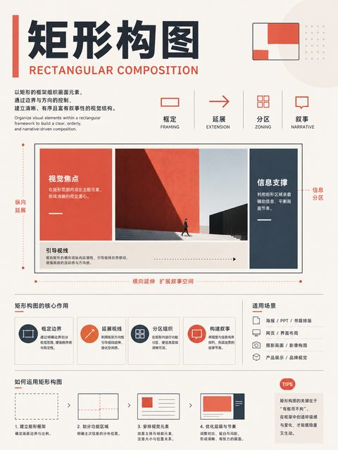</a> |
| :---: | :---: | :---: | :---: |
| **073**<br>平行透视构图 | **074**<br>斜投影构图 | **075**<br>等距构图 | **076**<br>轴测构图 |

<a id="default-viewpoint-focus"></a>

### 视点、景深与空间感 · 10 种

俯仰视角、强制透视、景深与平面化。 `077–086`

| <a href="v2/images/01-composition-logic/077-鸟瞰构图.png"></a> | <a href="v2/images/01-composition-logic/078-虫视构图.png"></a> | <a href="v2/images/01-composition-logic/079-顶视构图.png"></a> | <a href="v2/images/01-composition-logic/080-平视构图.png"></a> |
| :---: | :---: | :---: | :---: |
| **077**<br>鸟瞰构图 | **078**<br>虫视构图 | **079**<br>顶视构图 | **080**<br>平视构图 |

| <a href="v2/images/01-composition-logic/081-强制透视构图.png">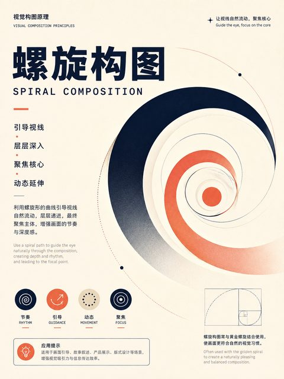</a> | <a href="v2/images/01-composition-logic/082-空气透视构图.png">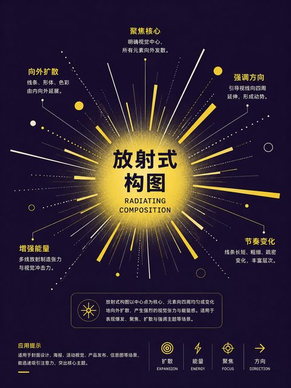</a> | <a href="v2/images/01-composition-logic/083-浅景深构图.png">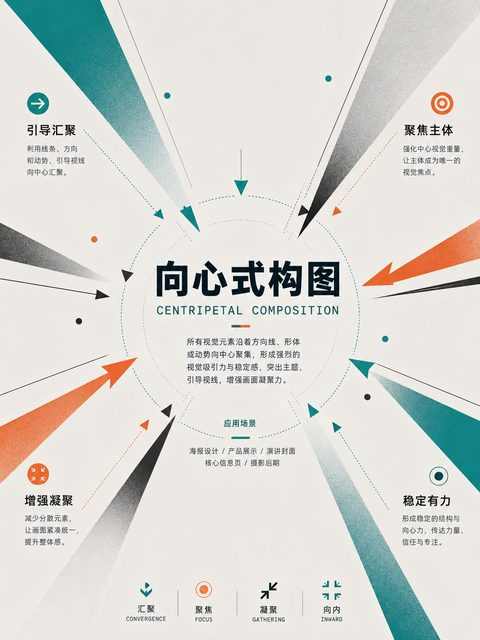</a> | <a href="v2/images/01-composition-logic/084-深焦构图.png"></a> |
| :---: | :---: | :---: | :---: |
| **081**<br>强制透视构图 | **082**<br>空气透视构图 | **083**<br>浅景深构图 | **084**<br>深焦构图 |

| <a href="v2/images/01-composition-logic/085-平面化构图.png"></a> | <a href="v2/images/01-composition-logic/086-深空间构图.png">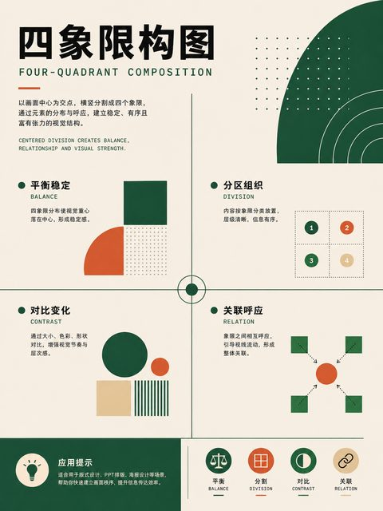</a> |  |  |
| :---: | :---: | :---: | :---: |
| **085**<br>平面化构图 | **086**<br>深空间构图 | &nbsp; | &nbsp; |

<!-- default-gallery:end -->
## 其他分类 · 展开即看

<details>
<summary><strong>02 · 视觉原则与阅读模式</strong>　45 种 · 5 个主题</summary>

[平衡、动势与焦点](docs/350/02-visual-principles.md#balance-focus) · [层级、比例与对比](docs/350/02-visual-principles.md#hierarchy-contrast) · [重复、图案与节奏](docs/350/02-visual-principles.md#repetition-rhythm) · [格式塔与组群](docs/350/02-visual-principles.md#gestalt-grouping) · [页面阅读模式](docs/350/02-visual-principles.md#reading-patterns)

</details>

<details>
<summary><strong>03 · 平面、出版与广告</strong>　36 种 · 4 个主题</summary>

[分栏、跨页与出血](docs/350/03-editorial-advertising.md#columns-spreads) · [图文主导与表现型版式](docs/350/03-editorial-advertising.md#expressive-layouts) · [模块、侧栏与图文关系](docs/350/03-editorial-advertising.md#modules-annotations) · [出版功能页面](docs/350/03-editorial-advertising.md#editorial-pages)

</details>

<details>
<summary><strong>04 · 字体、网格与东亚文字</strong>　54 种 · 4 个主题</summary>

[字体组织系统](docs/350/04-type-grid-cjk.md#type-systems) · [对齐、缩进与文字造型](docs/350/04-type-grid-cjk.md#typesetting) · [网格系统](docs/350/04-type-grid-cjk.md#grid-systems) · [东亚文字与混排](docs/350/04-type-grid-cjk.md#cjk-writing)

</details>

<details>
<summary><strong>05 · 网页与 UI</strong>　79 种 · 5 个主题</summary>

[CSS 流、定位与响应](docs/350/05-web-ui.md#css-layout) · [布局原语](docs/350/05-web-ui.md#layout-primitives) · [页面框架与导航](docs/350/05-web-ui.md#page-navigation) · [内容与产品模式](docs/350/05-web-ui.md#product-patterns) · [响应式重排模式](docs/350/05-web-ui.md#responsive-patterns)

</details>

<details>
<summary><strong>06 · 影视画面构图</strong>　14 种 · 3 个主题</summary>

[人物数量与群像](docs/350/06-film-frame.md#subject-count) · [视角与镜头覆盖](docs/350/06-film-frame.md#viewpoint-coverage) · [场面调度与景深](docs/350/06-film-frame.md#blocking-depth)

</details>

<details>
<summary><strong>07 · 中国传统构图</strong>　20 种 · 3 个主题</summary>

[三远、透视与游观](docs/350/07-chinese-composition.md#perspective-roaming) · [取景与景式](docs/350/07-chinese-composition.md#scene-framing) · [留白、虚实与章法](docs/350/07-chinese-composition.md#blank-rhythm)

</details>

<details>
<summary><strong>08 · 演示文稿页面</strong>　16 种 · 2 个主题</summary>

[基础幻灯片](docs/350/08-presentation.md#core-slides) · [叙事与数据页面](docs/350/08-presentation.md#story-data-slides)

</details>

## 下载与数据

- 单张高清图：在分类页面点击任意缩略图，即可打开 1086 × 1448 PNG。
- 全部高清图：[下载新版 350 张高清图片 ZIP](https://github.com/nevertoday/350-layout-compositions/releases/latest/download/350-layout-compositions-images.zip)，或浏览 [`v2/images/`](v2/images/)。
- 数据目录：[`catalog.csv`](v2/catalog.csv) / [`catalog.json`](v2/catalog.json)，包含编号、名称、一级/二级分类、路径、尺寸与 SHA-256。
- 经典版 ZIP：[下载旧版 100 张高清图片](https://github.com/nevertoday/350-layout-compositions/releases/latest/download/100-layout-compositions-images.zip)。

## 项目结构

```text
v2/images/        新版 350 张高清 PNG，按 8 类组织
v2/thumbnails/    新版 GitHub 预览缩略图
v2/catalog.*      新版机器可读目录（CSV / JSON）
docs/350/         新版总目录与 8 个分类画廊
images/           经典版 100 张高清 PNG（保留）
thumbnails/       经典版 100 张缩略图（保留）
scripts/          新版素材导入与画廊生成工具
dist/             本地生成的发布压缩包，不提交到 Git
```

## 经典版：100 种排版

下面是项目最初发布的 100 张排版构图。它们继续保留，方便已有引用和收藏使用。

<!-- gallery:start -->
<p align="center">
  <a href="images/layout-001.png"></a>
  <a href="images/layout-002.png"></a>
  <a href="images/layout-003.png"></a>
  <a href="images/layout-004.png"></a>
</p>

<p align="center">
  <a href="images/layout-005.png"></a>
  <a href="images/layout-006.png"></a>
  <a href="images/layout-007.png"></a>
  <a href="images/layout-008.png"></a>
</p>

<p align="center">
  <a href="images/layout-009.png"></a>
  <a href="images/layout-010.png"></a>
  <a href="images/layout-011.png"></a>
  <a href="images/layout-012.png"></a>
</p>

<p align="center">
  <a href="images/layout-013.png"></a>
  <a href="images/layout-014.png"></a>
  <a href="images/layout-015.png"></a>
  <a href="images/layout-016.png"></a>
</p>

<p align="center">
  <a href="images/layout-017.png"></a>
  <a href="images/layout-018.png"></a>
  <a href="images/layout-019.png"></a>
  <a href="images/layout-020.png"></a>
</p>

<p align="center">
  <a href="images/layout-021.png"></a>
  <a href="images/layout-022.png"></a>
  <a href="images/layout-023.png"></a>
  <a href="images/layout-024.png"></a>
</p>

<p align="center">
  <a href="images/layout-025.png"></a>
  <a href="images/layout-026.png"></a>
  <a href="images/layout-027.png"></a>
  <a href="images/layout-028.png"></a>
</p>

<p align="center">
  <a href="images/layout-029.png"></a>
  <a href="images/layout-030.png"></a>
  <a href="images/layout-031.png"></a>
  <a href="images/layout-032.png"></a>
</p>

<p align="center">
  <a href="images/layout-033.png"></a>
  <a href="images/layout-034.png"></a>
  <a href="images/layout-035.png"></a>
  <a href="images/layout-036.png"></a>
</p>

<p align="center">
  <a href="images/layout-037.png"></a>
  <a href="images/layout-038.png"></a>
  <a href="images/layout-039.png"></a>
  <a href="images/layout-040.png"></a>
</p>

<p align="center">
  <a href="images/layout-041.png"></a>
  <a href="images/layout-042.png"></a>
  <a href="images/layout-043.png"></a>
  <a href="images/layout-044.png"></a>
</p>

<p align="center">
  <a href="images/layout-045.png"></a>
  <a href="images/layout-046.png"></a>
  <a href="images/layout-047.png"></a>
  <a href="images/layout-048.png"></a>
</p>

<p align="center">
  <a href="images/layout-049.png"></a>
  <a href="images/layout-050.png"></a>
  <a href="images/layout-051.png"></a>
  <a href="images/layout-052.png"></a>
</p>

<p align="center">
  <a href="images/layout-053.png"></a>
  <a href="images/layout-054.png"></a>
  <a href="images/layout-055.png"></a>
  <a href="images/layout-056.png"></a>
</p>

<p align="center">
  <a href="images/layout-057.png"></a>
  <a href="images/layout-058.png"></a>
  <a href="images/layout-059.png"></a>
  <a href="images/layout-060.png"></a>
</p>

<p align="center">
  <a href="images/layout-061.png"></a>
  <a href="images/layout-062.png"></a>
  <a href="images/layout-063.png"></a>
  <a href="images/layout-064.png"></a>
</p>

<p align="center">
  <a href="images/layout-065.png"></a>
  <a href="images/layout-066.png"></a>
  <a href="images/layout-067.png"></a>
  <a href="images/layout-068.png"></a>
</p>

<p align="center">
  <a href="images/layout-069.png"></a>
  <a href="images/layout-070.png"></a>
  <a href="images/layout-071.png"></a>
  <a href="images/layout-072.png"></a>
</p>

<p align="center">
  <a href="images/layout-073.png"></a>
  <a href="images/layout-074.png"></a>
  <a href="images/layout-075.png"></a>
  <a href="images/layout-076.png"></a>
</p>

<p align="center">
  <a href="images/layout-077.png"></a>
  <a href="images/layout-078.png"></a>
  <a href="images/layout-079.png"></a>
  <a href="images/layout-080.png"></a>
</p>

<p align="center">
  <a href="images/layout-081.png"></a>
  <a href="images/layout-082.png"></a>
  <a href="images/layout-083.png"></a>
  <a href="images/layout-084.png"></a>
</p>

<p align="center">
  <a href="images/layout-085.png"></a>
  <a href="images/layout-086.png"></a>
  <a href="images/layout-087.png"></a>
  <a href="images/layout-088.png"></a>
</p>

<p align="center">
  <a href="images/layout-089.png"></a>
  <a href="images/layout-090.png"></a>
  <a href="images/layout-091.png"></a>
  <a href="images/layout-092.png"></a>
</p>

<p align="center">
  <a href="images/layout-093.png"></a>
  <a href="images/layout-094.png"></a>
  <a href="images/layout-095.png"></a>
  <a href="images/layout-096.png"></a>
</p>

<p align="center">
  <a href="images/layout-097.png"></a>
  <a href="images/layout-098.png"></a>
  <a href="images/layout-099.png"></a>
  <a href="images/layout-100.png"></a>
</p>

<!-- gallery:end -->

## 使用说明

- 交流、学习和个人参考可以直接下载使用。
- 如果你要二次发布、改编或商用，请先确认图片生成来源、人物/品牌/素材权利是否覆盖对应用途。
- 如果你基于这些图片做了新的排版实验，欢迎在 Issue 或 Discussion 里交流。

## 广告信息｜XXD 付费服务与会员

> **广告与商业信息声明：** 以下二维码、会员与付费服务链接属于小小东的广告信息。是否扫码或购买完全自愿，不影响本开源项目的访问与使用。

### 小小东总控 · 将军总指挥 Skill · 100 元

一次支付 100 元获得将军总指挥 Skill（`xxd-panel-all`），用于主控、推荐、点将和批量调度全部士兵 Skills。扫码后请备注“将军总指挥 Skill”。

**购买后可使用：主控全队的将军 Skill**

| 层级 | Skill | 负责什么 |
| --- | --- | --- |
| **将军级** | [`xxd-panel-all`](https://github.com/nevertoday/xxd-panel-all) | 识别当前可用的编号 Skills；按图片、主题和用途推荐；按编号点将；组织同图多风格试稿；为图片文件夹批量分配并逐项派发。 |
| **士兵级** | `xxd-panel-NNN`（当前 001–100） | 每个编号只执行自己独立的原始提示词与审美，把将军派发的单个任务完成为成品。 |

将军 Skill 是整个编号 Skills 队伍的总控入口。购买后即可使用，并获得安装、版本更新、队伍配置和调度方式的答疑。将军只负责组织与派发，不会改写、混合或覆盖士兵的原始美学；每张成品仍由被选中的士兵 Skill 独立完成。

### 知识星球＋成员提示词库＋Skills 所有将军会员 · 699 元/年

[知识星球](https://wx.zsxq.com/group/15554814142882)、[小小东成员提示词库](https://vip.xiaoxiaodong.ai/)与 Skills 所有将军会员是同一份会员权益：**一次年费同时开通三项权益，无需重复付费。**

[Knowledge Planet](https://wx.zsxq.com/group/15554814142882) · [Member Prompt Library](https://vip.xiaoxiaodong.ai/)

<p align="center"><a href="https://xiaoxiaodong.pages.dev/assets/wechat-qr.png"></a></p>

## 联系作者

可以通过作者 X 主页联系：[@xiaoxiaodong01](https://x.com/xiaoxiaodong01)。

## 许可证

本仓库默认使用 [CC BY 4.0](LICENSE) 授权：允许署名转载、分享和改编。
