# 视觉原则与阅读模式 · 45 种

用格式塔原则、视觉层级和阅读路径解释信息如何被看见与理解。

[← 返回 350 种排版总目录](README.md)

| <a href="../../v2/images/02-visual-principles/087-放射平衡原则.png">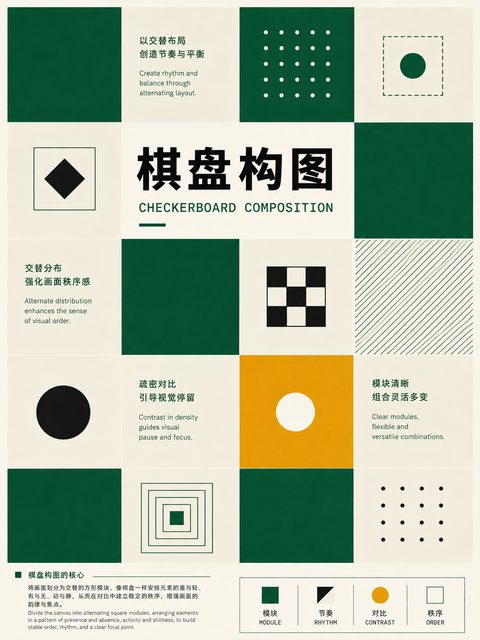</a> |  |  |  |
| :---: | :---: | :---: | :---: |
| **087** 放射平衡原则 | **088** 晶体式平衡原则 | **089** 静态构图 | **090** 动态构图 |

| <a href="../../v2/images/02-visual-principles/091-开放式构图.png">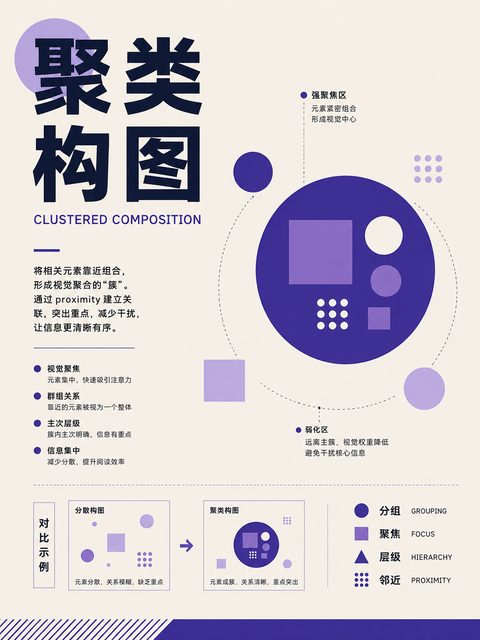</a> |  |  | <a href="../../v2/images/02-visual-principles/094-多重焦点构图.png">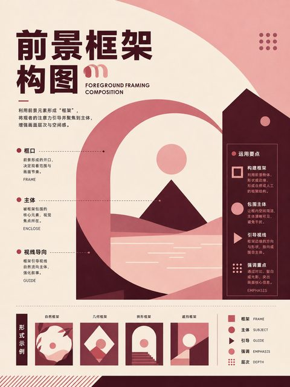</a> |
| :---: | :---: | :---: | :---: |
| **091** 开放式构图 | **092** 封闭式构图 | **093** 单一焦点构图 | **094** 多重焦点构图 |

| <a href="../../v2/images/02-visual-principles/095-视觉层级原则.png">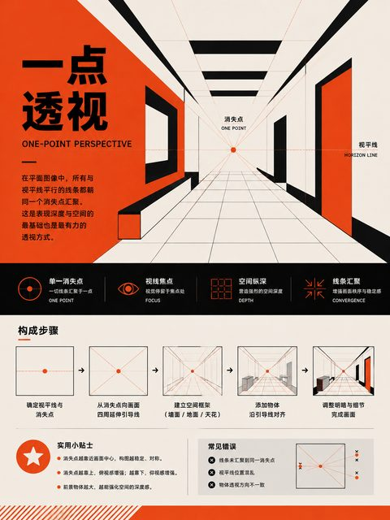</a> |  | <a href="../../v2/images/02-visual-principles/097-平衡原则.png">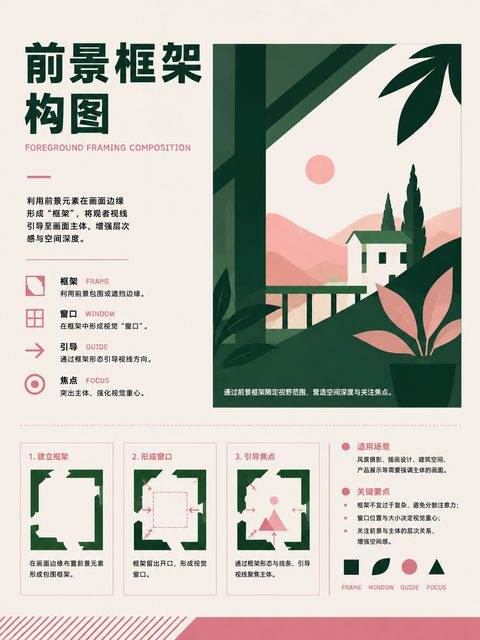</a> | <a href="../../v2/images/02-visual-principles/098-比例原则.png">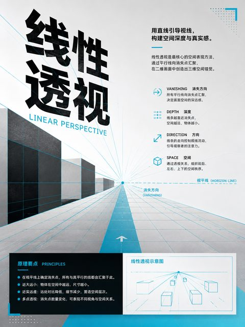</a> |
| :---: | :---: | :---: | :---: |
| **095** 视觉层级原则 | **096** 主次关系原则 | **097** 平衡原则 | **098** 比例原则 |

| <a href="../../v2/images/02-visual-principles/099-尺度对比原则.png">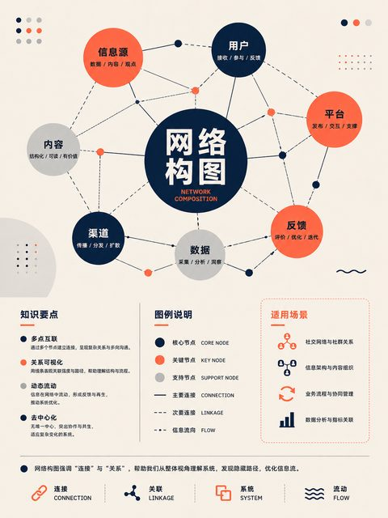</a> |  | <a href="../../v2/images/02-visual-principles/101-色彩对比原则.png">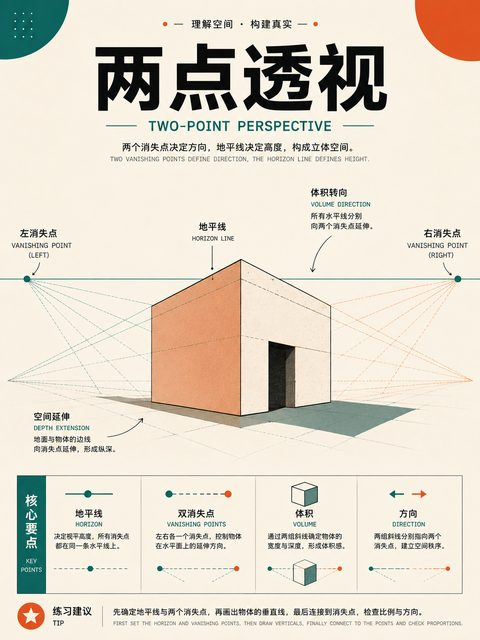</a> | <a href="../../v2/images/02-visual-principles/102-形状对比原则.png">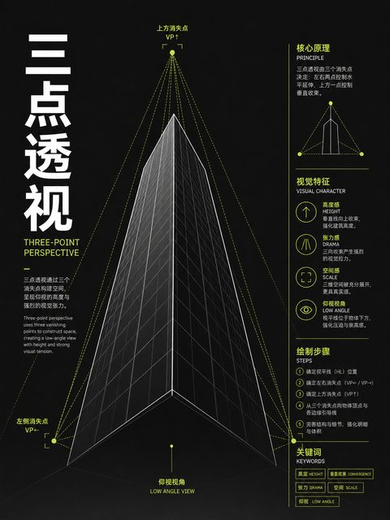</a> |
| :---: | :---: | :---: | :---: |
| **099** 尺度对比原则 | **100** 明暗对比原则 | **101** 色彩对比原则 | **102** 形状对比原则 |

|  |  |  | <a href="../../v2/images/02-visual-principles/106-隔离原则.png">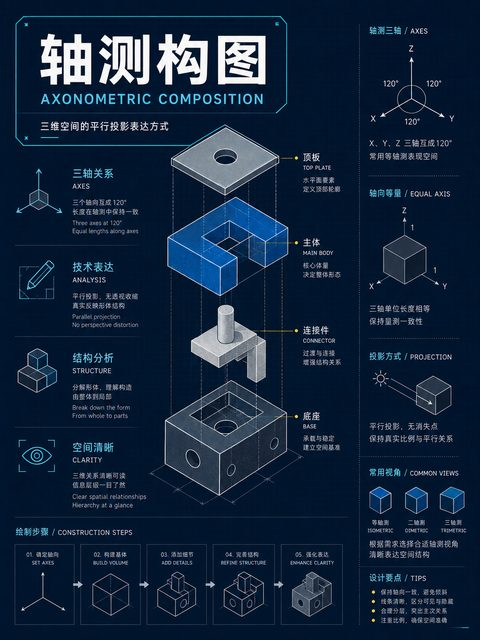</a> |
| :---: | :---: | :---: | :---: |
| **103** 质感对比原则 | **104** 动静对比原则 | **105** 并置原则 | **106** 隔离原则 |

|  |  |  | <a href="../../v2/images/02-visual-principles/110-渐变组织.png">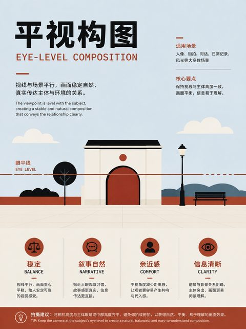</a> |
| :---: | :---: | :---: | :---: |
| **107** 重复原则 | **108** 图案组织 | **109** 节奏组织 | **110** 渐变组织 |

| <a href="../../v2/images/02-visual-principles/111-交替节奏组织.png">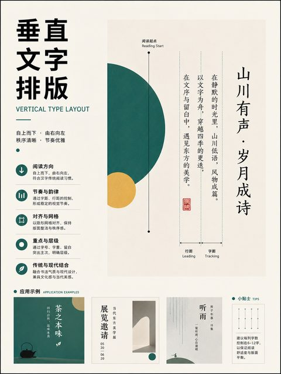</a> |  |  | <a href="../../v2/images/02-visual-principles/114-随机节奏组织.png">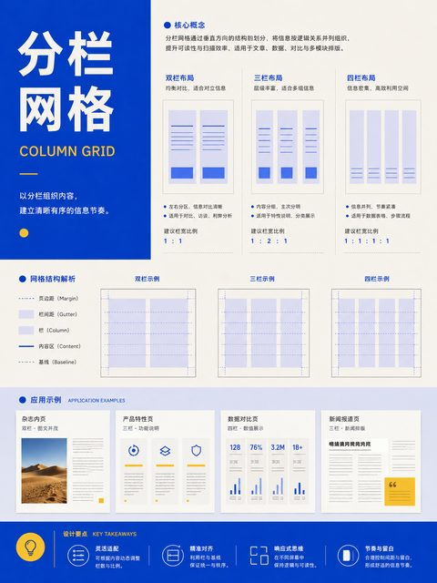</a> |
| :---: | :---: | :---: | :---: |
| **111** 交替节奏组织 | **112** 渐进节奏组织 | **113** 流动节奏组织 | **114** 随机节奏组织 |

|  |  | <a href="../../v2/images/02-visual-principles/117-连续性原则.png">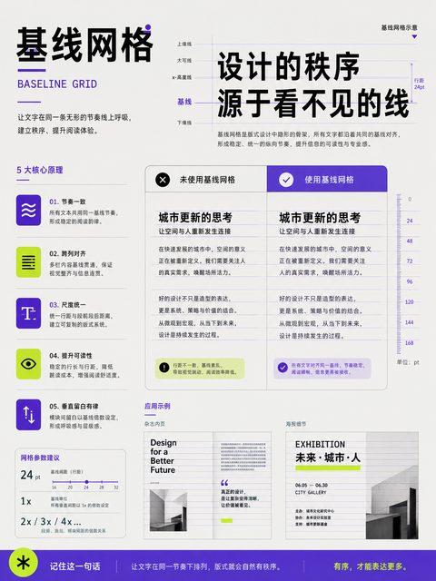</a> |  |
| :---: | :---: | :---: | :---: |
| **115** 相似性原则 | **116** 邻近性原则 | **117** 连续性原则 | **118** 闭合性原则 |

| <a href="../../v2/images/02-visual-principles/119-图底关系原则.png">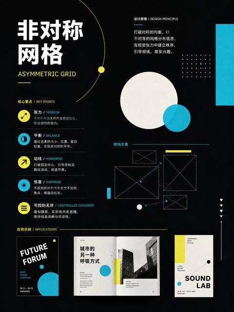</a> | <a href="../../v2/images/02-visual-principles/120-共同区域原则.png">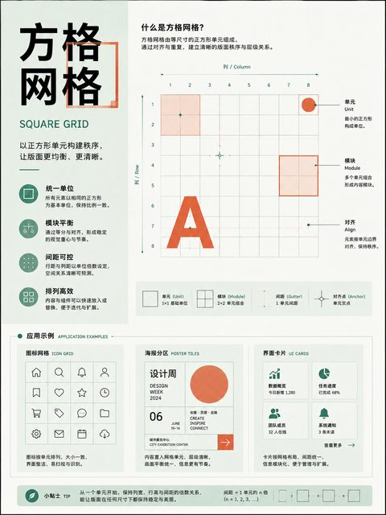</a> | <a href="../../v2/images/02-visual-principles/121-共同命运原则.png">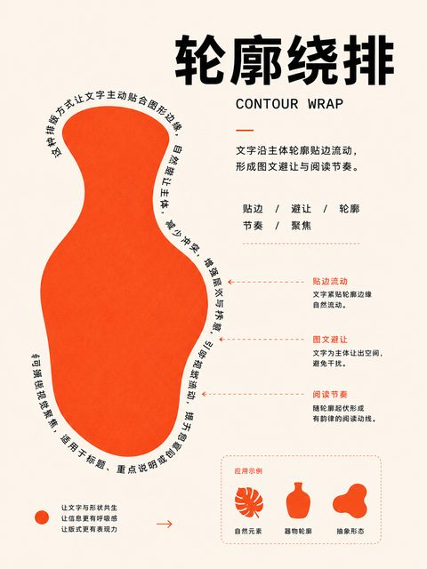</a> |  |
| :---: | :---: | :---: | :---: |
| **119** 图底关系原则 | **120** 共同区域原则 | **121** 共同命运原则 | **122** 简化构图原则 |

| <a href="../../v2/images/02-visual-principles/123-裁切构图.png">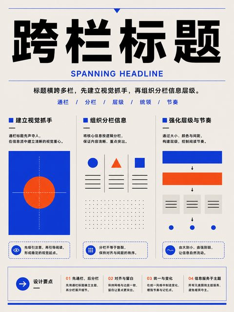</a> |  |  |  |
| :---: | :---: | :---: | :---: |
| **123** 裁切构图 | **124** 满幅构图 | **125** 疏密对比原则 | **126** 群组构图 |

|  |  |  |  |
| :---: | :---: | :---: | :---: |
| **127** F 型扫描模式 | **128** Z 型扫描模式 | **129** 古腾堡图式 | **130** 层蛋糕扫描模式 |

|  |  |  |  |
| :---: | :---: | :---: | :---: |
| **131** 斑点扫描模式 |  |  |  |
