# 平面、出版与广告 · 36 种

覆盖海报、书刊、包装、广告等常见平面媒介的版式结构。

[← 返回 350 种排版总目录](README.md)

**本类主题：** [分栏、跨页与出血](#columns-spreads) · [图文主导与表现型版式](#expressive-layouts) · [模块、侧栏与图文关系](#modules-annotations) · [出版功能页面](#editorial-pages)

## 分栏、跨页与出血 · 8 种

单栏到多栏、对称与非对称跨页、出血控制。 `132–139`

| <a href="../../v2/images/03-editorial-advertising/132-单栏版式.png">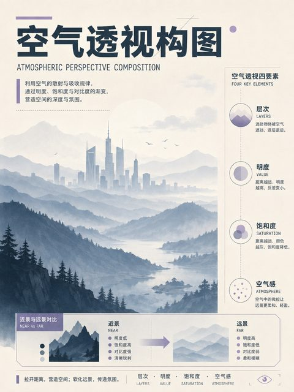</a> | <a href="../../v2/images/03-editorial-advertising/133-双栏版式.png">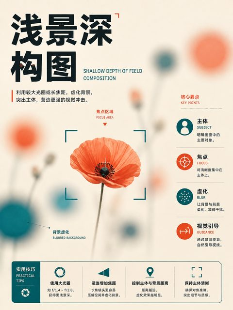</a> | <a href="../../v2/images/03-editorial-advertising/134-多栏版式.png">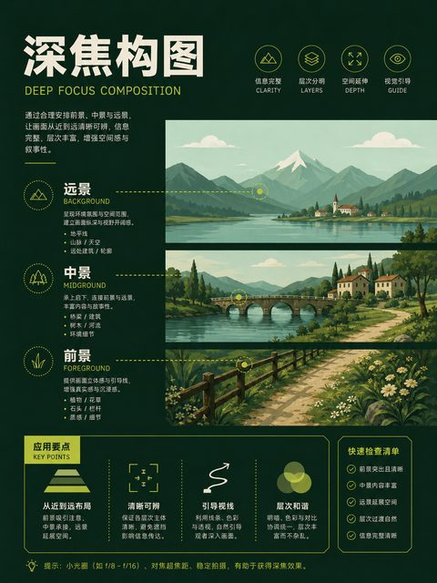</a> |  |
| :---: | :---: | :---: | :---: |
| **132** 单栏版式 | **133** 双栏版式 | **134** 多栏版式 | **135** 对称跨页 |

|  | <a href="../../v2/images/03-editorial-advertising/137-通版跨页.png">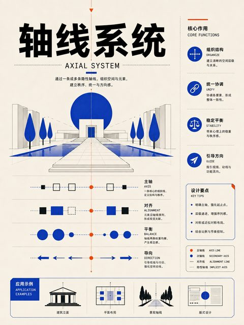</a> |  |  |
| :---: | :---: | :---: | :---: |
| **136** 非对称跨页 | **137** 通版跨页 | **138** 满出血版式 | **139** 无出血版式 |

## 图文主导与表现型版式 · 13 种

大标题、图片窗口、拼贴、蒙太奇和实验版式。 `140–152`

| <a href="../../v2/images/03-editorial-advertising/140-图片主导版式.png">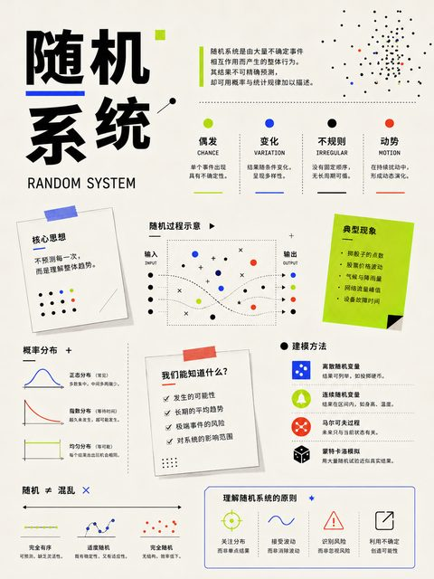</a> | <a href="../../v2/images/03-editorial-advertising/141-文字主导版式.png">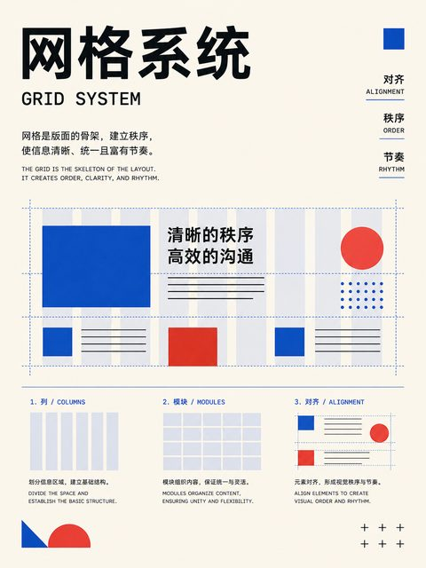</a> | <a href="../../v2/images/03-editorial-advertising/142-大标题版式.png">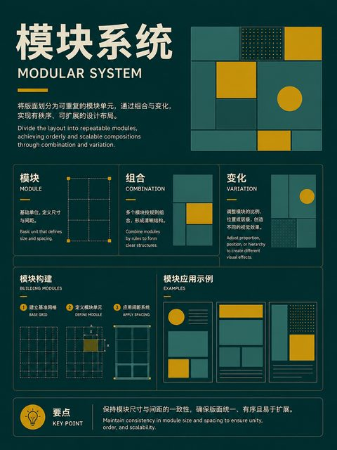</a> |  |
| :---: | :---: | :---: | :---: |
| **140** 图片主导版式 | **141** 文字主导版式 | **142** 大标题版式 | **143** 图片窗口版式 |

|  | <a href="../../v2/images/03-editorial-advertising/145-多面板版式.png">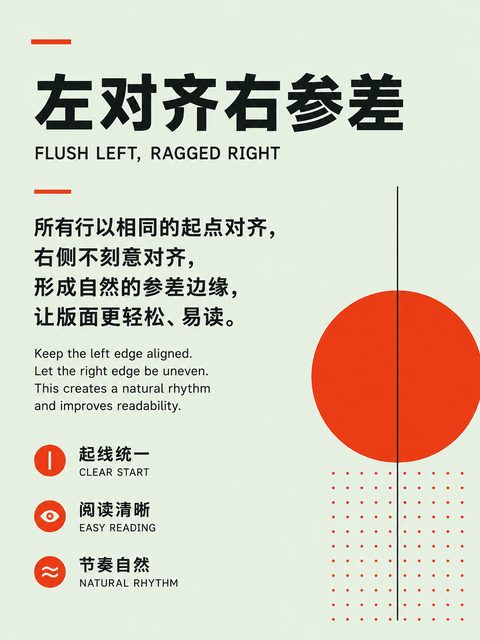</a> | <a href="../../v2/images/03-editorial-advertising/146-蒙德里安版式.png">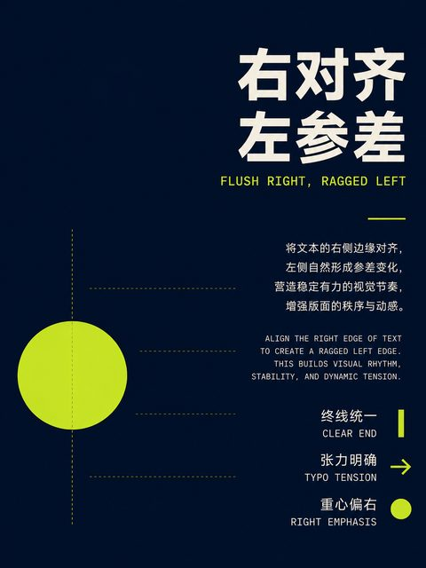</a> |  |
| :---: | :---: | :---: | :---: |
| **144** 框架版式 | **145** 多面板版式 | **146** 蒙德里安版式 | **147** 马戏团版式 |

| <a href="../../v2/images/03-editorial-advertising/148-剪影版式.png">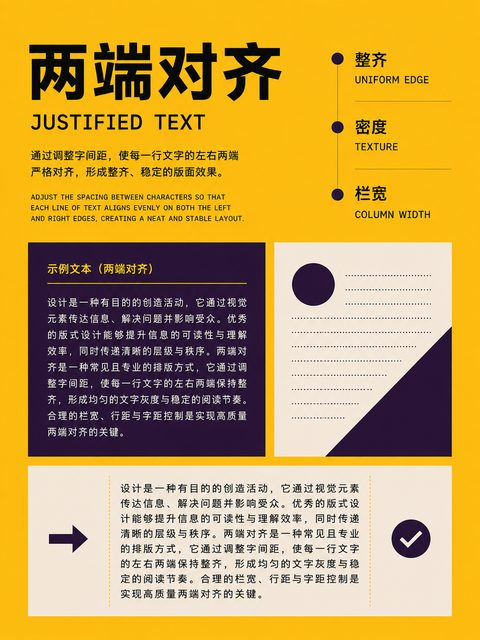</a> |  |  | <a href="../../v2/images/03-editorial-advertising/151-拼贴版式.png">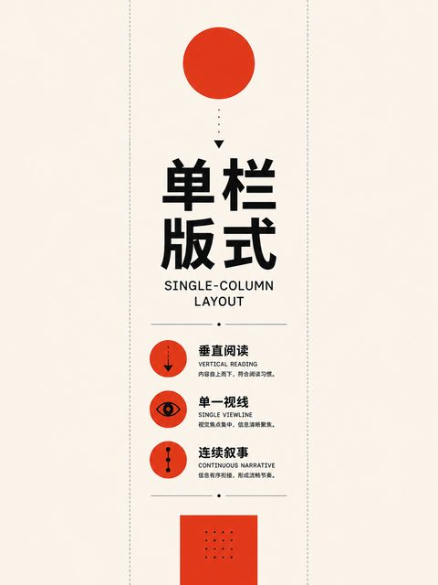</a> |
| :---: | :---: | :---: | :---: |
| **148** 剪影版式 | **149** 字母造型版式 | **150** 图文谜语版式 | **151** 拼贴版式 |

|  |  |  |  |
| :---: | :---: | :---: | :---: |
| **152** 蒙太奇版式 |  |  |  |

## 模块、侧栏与图文关系 · 7 种

模块化页面、区块、边注、环绕图和浮动块。 `153–159`

| <a href="../../v2/images/03-editorial-advertising/153-模块化页面.png">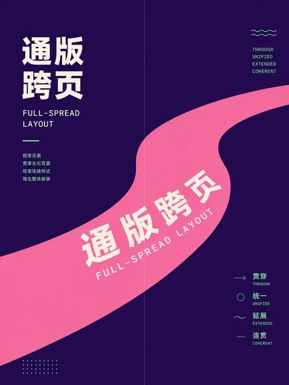</a> |  | <a href="../../v2/images/03-editorial-advertising/155-插页式版式.png">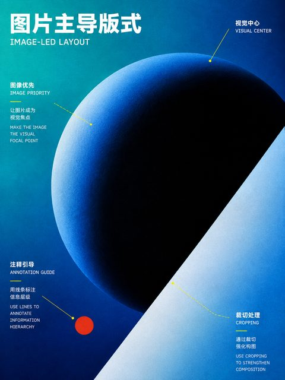</a> | <a href="../../v2/images/03-editorial-advertising/156-侧栏版式.png">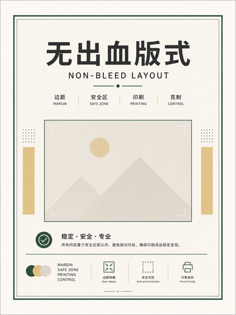</a> |
| :---: | :---: | :---: | :---: |
| **153** 模块化页面 | **154** 区块式版式 | **155** 插页式版式 | **156** 侧栏版式 |

|  | <a href="../../v2/images/03-editorial-advertising/158-环绕图版式.png">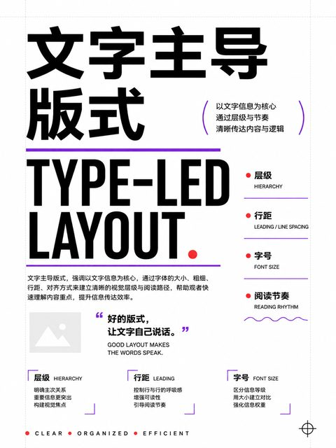</a> |  |  |
| :---: | :---: | :---: | :---: |
| **157** 边注版式 | **158** 环绕图版式 | **159** 浮动块版式 |  |

## 出版功能页面 · 8 种

封面、扉页、目录、索引、图录与引语页面。 `160–167`

| <a href="../../v2/images/03-editorial-advertising/160-封面版式.png">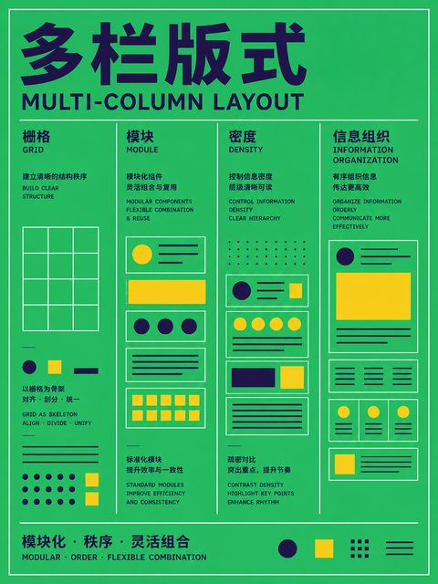</a> |  | <a href="../../v2/images/03-editorial-advertising/162-栏目开启页.png">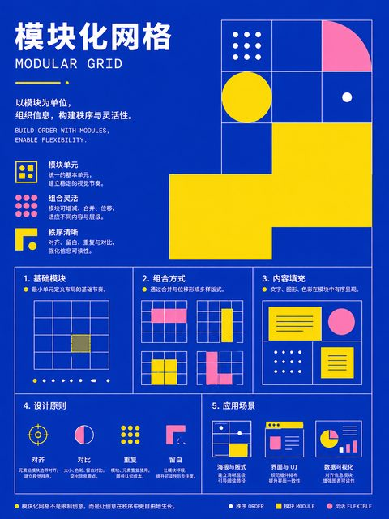</a> | <a href="../../v2/images/03-editorial-advertising/163-特写跨页.png">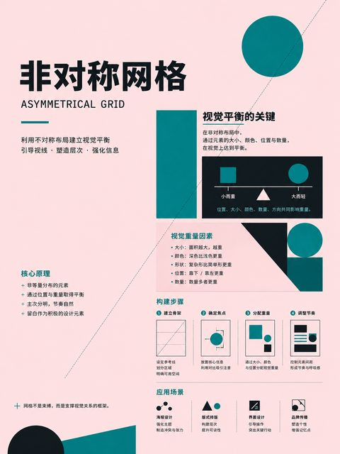</a> |
| :---: | :---: | :---: | :---: |
| **160** 封面版式 | **161** 章节扉页 | **162** 栏目开启页 | **163** 特写跨页 |

|  | <a href="../../v2/images/03-editorial-advertising/165-索引版式.png">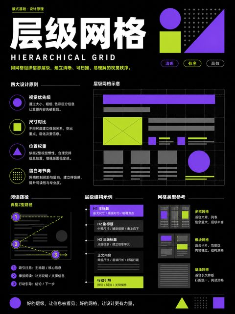</a> | <a href="../../v2/images/03-editorial-advertising/166-图录版式.png">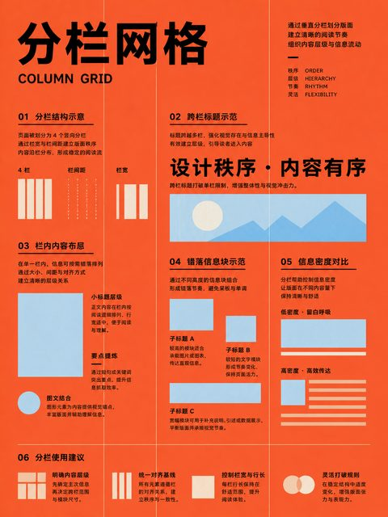</a> |  |
| :---: | :---: | :---: | :---: |
| **164** 目录版式 | **165** 索引版式 | **166** 图录版式 | **167** 引语主导版式 |
