# 字体、网格与东亚文字 · 54 种

聚焦字体编排、网格系统，以及横排、直排和中西文混排。

[← 返回 350 种排版总目录](README.md)

**本类主题：** [字体组织系统](#type-systems) · [对齐、缩进与文字造型](#typesetting) · [网格系统](#grid-systems) · [东亚文字与混排](#cjk-writing)

## 字体组织系统 · 8 种

轴线、放射、扩张、随机、网格与双边系统。 `168–175`

|  |  | <a href="../../v2/images/04-type-grid-cjk/170-扩张系统.png">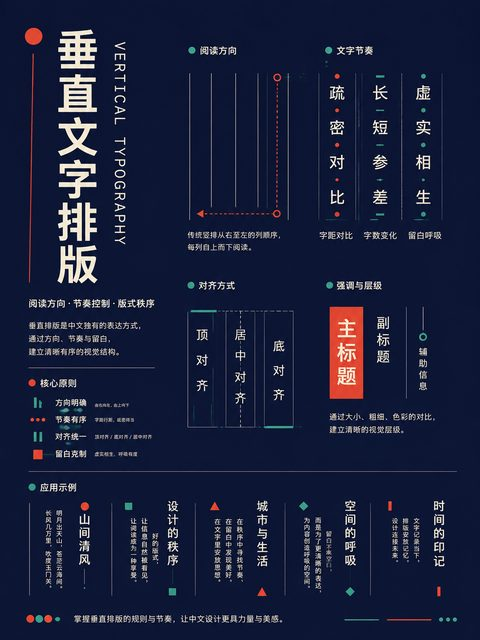</a> | <a href="../../v2/images/04-type-grid-cjk/171-随机系统.png">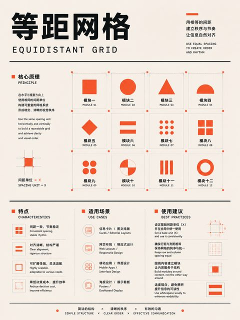</a> |
| :---: | :---: | :---: | :---: |
| **168** 轴线系统 | **169** 放射系统 | **170** 扩张系统 | **171** 随机系统 |

|  |  |  |  |
| :---: | :---: | :---: | :---: |
| **172** 网格系统 | **173** 模块系统 | **174** 过渡系统 | **175** 双边系统 |

## 对齐、缩进与文字造型 · 18 种

对齐方式、绕排、缩进、基线、路径与横竖排。 `176–193`

| <a href="../../v2/images/04-type-grid-cjk/176-左对齐右参差.png">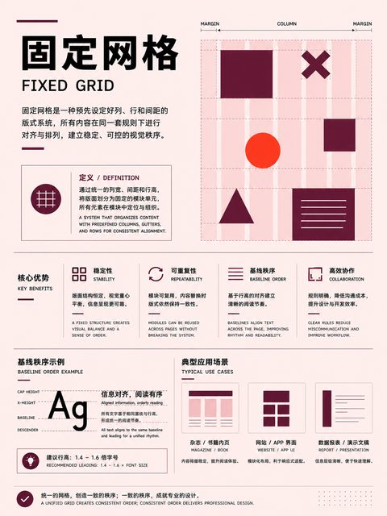</a> |  | <a href="../../v2/images/04-type-grid-cjk/178-居中排版.png">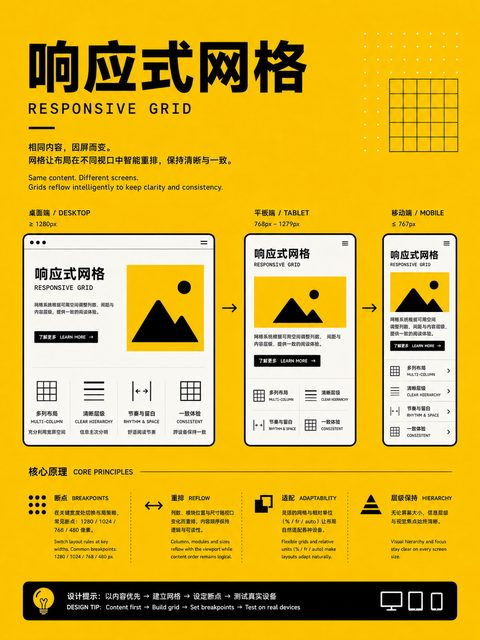</a> |  |
| :---: | :---: | :---: | :---: |
| **176** 左对齐右参差 | **177** 右对齐左参差 | **178** 居中排版 | **179** 两端对齐 |

| <a href="../../v2/images/04-type-grid-cjk/180-强制两端对齐.png">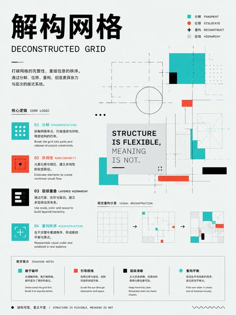</a> |  | <a href="../../v2/images/04-type-grid-cjk/182-轮廓绕排.png">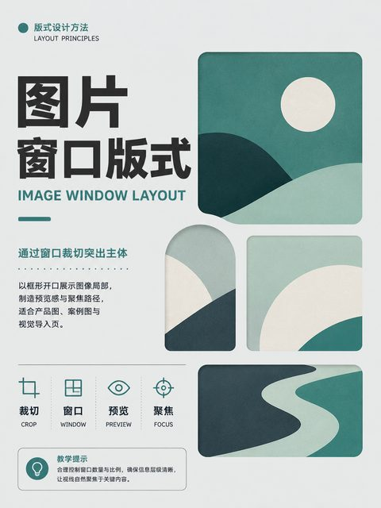</a> | <a href="../../v2/images/04-type-grid-cjk/183-矩形绕排.png">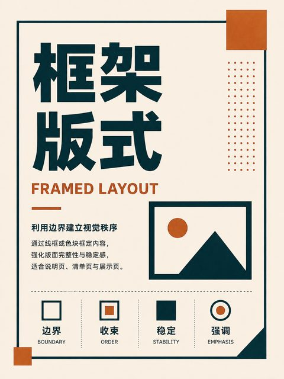</a> |
| :---: | :---: | :---: | :---: |
| **180** 强制两端对齐 | **181** 非对称字体排版 | **182** 轮廓绕排 | **183** 矩形绕排 |

| <a href="../../v2/images/04-type-grid-cjk/184-跨栏标题.png">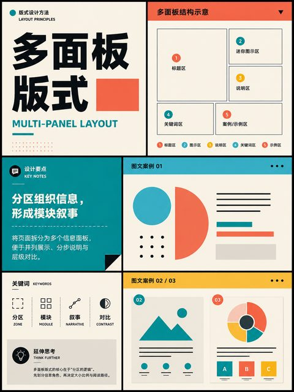</a> | <a href="../../v2/images/04-type-grid-cjk/185-悬挂缩进.png">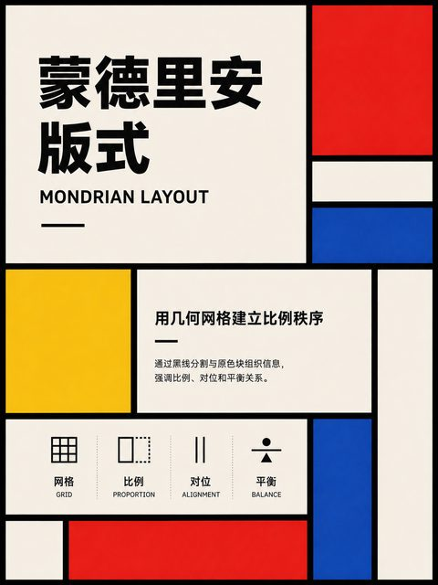</a> |  |  |
| :---: | :---: | :---: | :---: |
| **184** 跨栏标题 | **185** 悬挂缩进 | **186** 首行缩进 | **187** 凸排标点 |

|  | <a href="../../v2/images/04-type-grid-cjk/189-形状文字.png">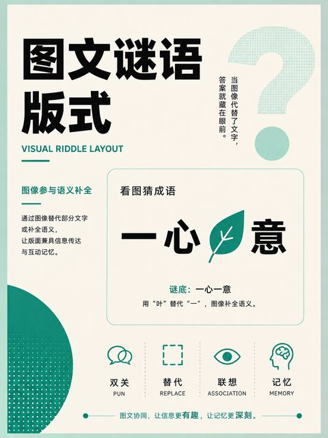</a> |  |  |
| :---: | :---: | :---: | :---: |
| **188** 基线对齐 | **189** 形状文字 | **190** 图形诗排版 | **191** 路径文字 |

|  |  |  |  |
| :---: | :---: | :---: | :---: |
| **192** 垂直文字排版 | **193** 水平文字排版 |  |  |

## 网格系统 · 18 种

手稿、分栏、模块、层级、响应式与解构网格。 `194–211`

|  |  | <a href="../../v2/images/04-type-grid-cjk/196-模块化网格.png">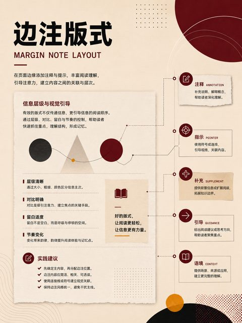</a> |  |
| :---: | :---: | :---: | :---: |
| **194** 手稿网格 | **195** 分栏网格 | **196** 模块化网格 | **197** 层级网格 |

|  |  |  | <a href="../../v2/images/04-type-grid-cjk/201-方格网格.png">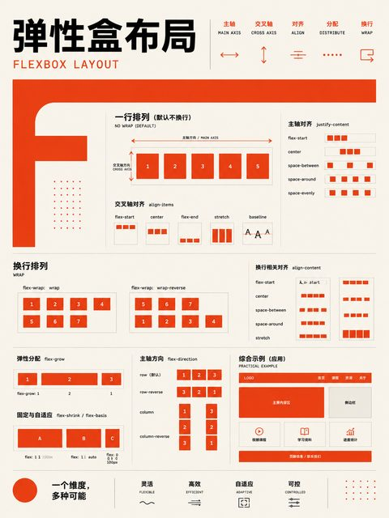</a> |
| :---: | :---: | :---: | :---: |
| **198** 基线网格 | **199** 复合网格 | **200** 非对称网格 | **201** 方格网格 |

| <a href="../../v2/images/04-type-grid-cjk/202-等距网格.png">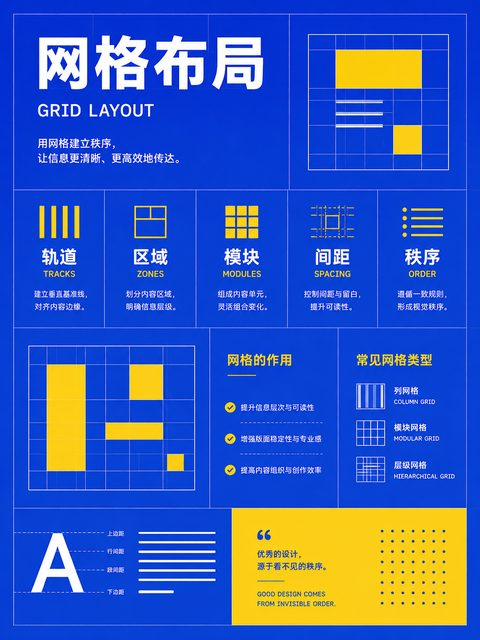</a> | <a href="../../v2/images/04-type-grid-cjk/203-放射网格.png">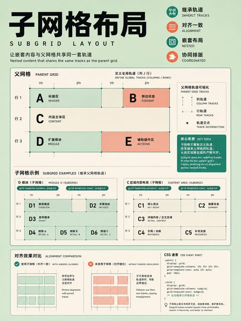</a> | <a href="../../v2/images/04-type-grid-cjk/204-极坐标网格.png">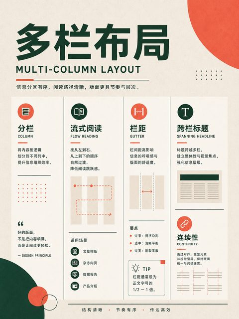</a> |  |
| :---: | :---: | :---: | :---: |
| **202** 等距网格 | **203** 放射网格 | **204** 极坐标网格 | **205** 嵌套网格 |

|  | <a href="../../v2/images/04-type-grid-cjk/207-固定网格.png">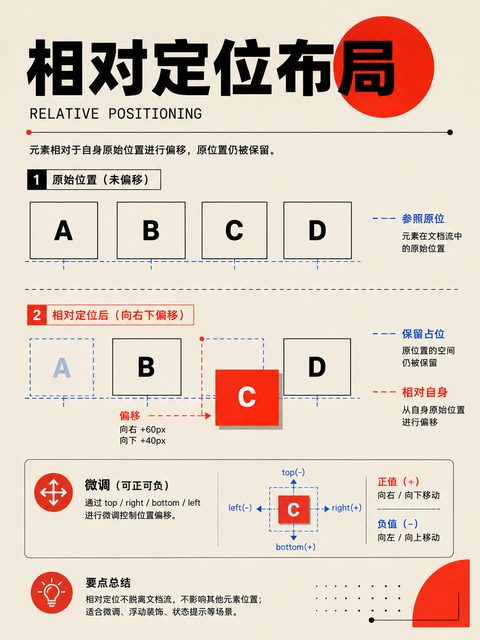</a> |  |  |
| :---: | :---: | :---: | :---: |
| **206** 子网格 | **207** 固定网格 | **208** 流体网格 | **209** 响应式网格 |

| <a href="../../v2/images/04-type-grid-cjk/210-破格网格.png">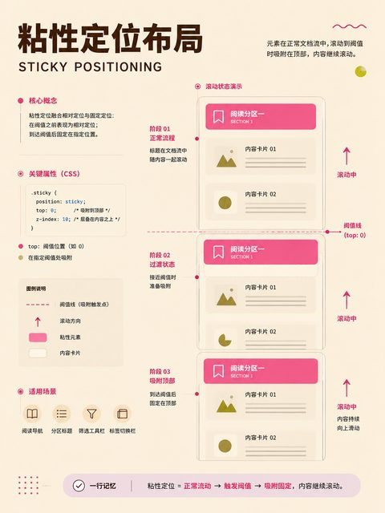</a> | <a href="../../v2/images/04-type-grid-cjk/211-解构网格.png">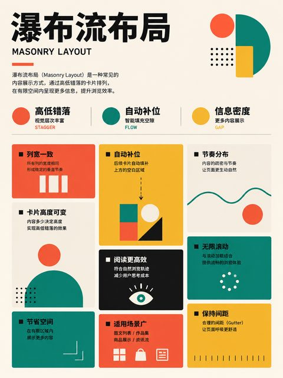</a> |  |  |
| :---: | :---: | :---: | :---: |
| **210** 破格网格 | **211** 解构网格 |  |  |

## 东亚文字与混排 · 10 种

横排、直排、纵中横、中西文转向、双向与旁注。 `212–221`

|  |  | <a href="../../v2/images/04-type-grid-cjk/214-直排右起.png">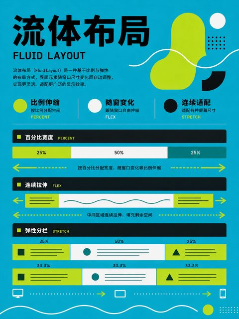</a> |  |
| :---: | :---: | :---: | :---: |
| **212** 横排左起 | **213** 横排右起 | **214** 直排右起 | **215** 直排左起 |

|  |  |  | <a href="../../v2/images/04-type-grid-cjk/219-直排中西文直立.png">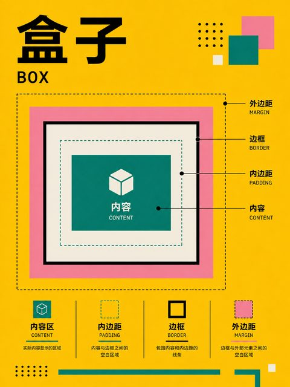</a> |
| :---: | :---: | :---: | :---: |
| **216** 横直混排 | **217** 纵中横排 | **218** 直排中西文转向 | **219** 直排中西文直立 |

|  | <a href="../../v2/images/04-type-grid-cjk/221-旁注（Ruby）排版.png">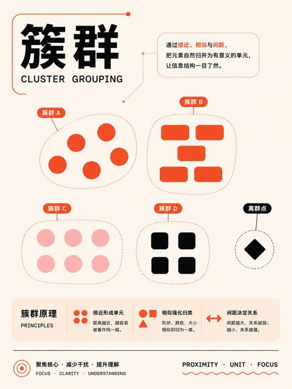</a> |  |  |
| :---: | :---: | :---: | :---: |
| **220** 双向文字排版 | **221** 旁注（Ruby）排版 |  |  |
