# 网页与 UI · 79 种

收录网站和产品界面的导航、内容、表单与响应式布局模式。

[← 返回 350 种排版总目录](README.md)

|  | <a href="../../v2/images/05-web-ui/223-块级布局.png">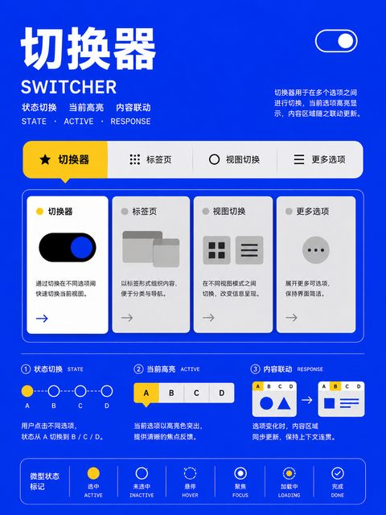</a> |  |  |
| :---: | :---: | :---: | :---: |
| **222** 普通流布局 | **223** 块级布局 | **224** 行内布局 | **225** 流根布局 |

|  |  |  |  |
| :---: | :---: | :---: | :---: |
| **226** 弹性盒布局 | **227** 网格布局 | **228** 子网格布局 | **229** 多栏布局 |

| <a href="../../v2/images/05-web-ui/230-表格布局.png">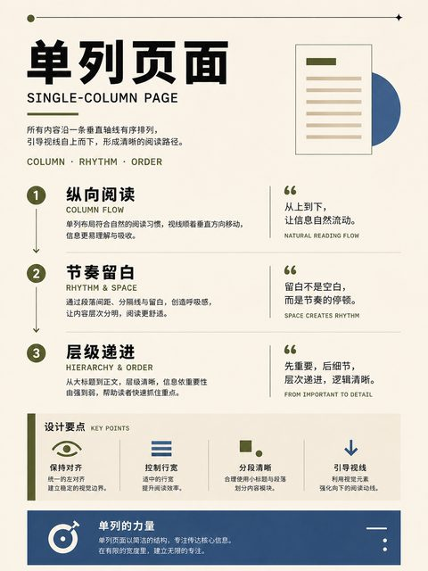</a> |  | <a href="../../v2/images/05-web-ui/232-相对定位布局.png">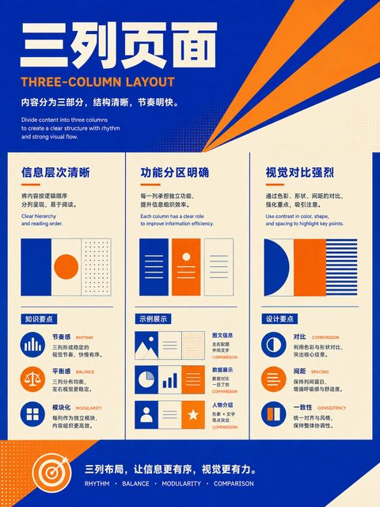</a> | <a href="../../v2/images/05-web-ui/233-绝对定位布局.png">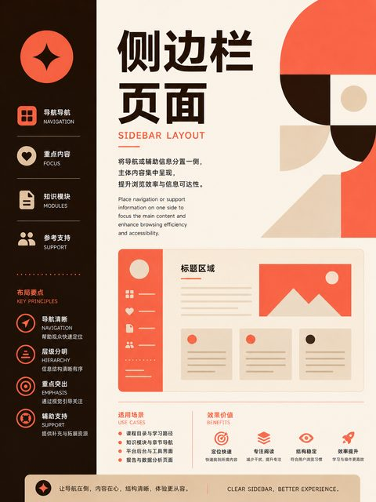</a> |
| :---: | :---: | :---: | :---: |
| **230** 表格布局 | **231** 浮动布局 | **232** 相对定位布局 | **233** 绝对定位布局 |

|  |  | <a href="../../v2/images/05-web-ui/236-瀑布流布局.png">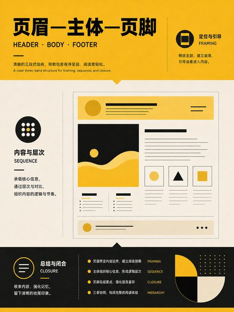</a> | <a href="../../v2/images/05-web-ui/237-覆盖布局.png">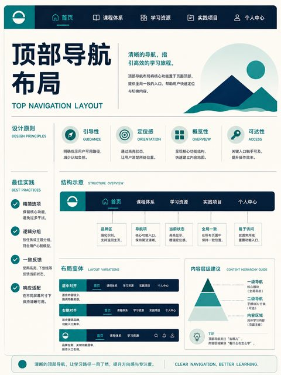</a> |
| :---: | :---: | :---: | :---: |
| **234** 固定定位布局 | **235** 粘性定位布局 | **236** 瀑布流布局 | **237** 覆盖布局 |

|  |  | <a href="../../v2/images/05-web-ui/240-响应式布局.png">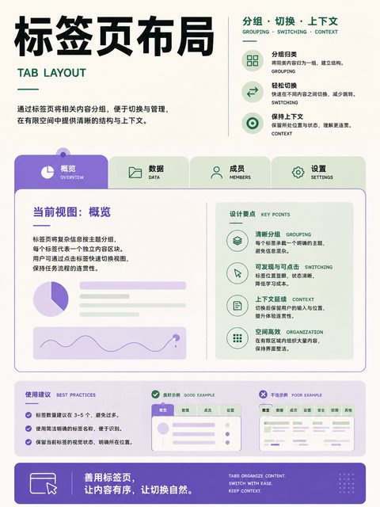</a> | <a href="../../v2/images/05-web-ui/241-自适应布局.png">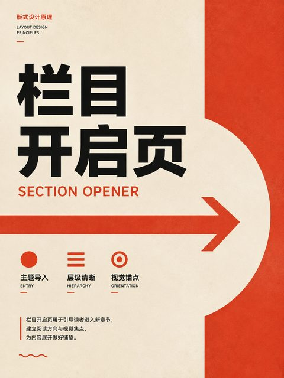</a> |
| :---: | :---: | :---: | :---: |
| **238** 固定宽度布局 | **239** 流体布局 | **240** 响应式布局 | **241** 自适应布局 |

| <a href="../../v2/images/05-web-ui/242-容器查询布局.png">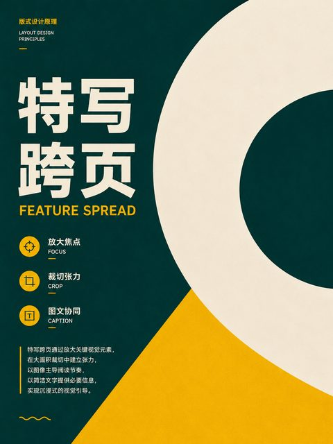</a> |  |  |  |
| :---: | :---: | :---: | :---: |
| **242** 容器查询布局 | **243** 堆栈 | **244** 盒子 | **245** 居中器 |

|  |  |  | <a href="../../v2/images/05-web-ui/249-封面原语.png">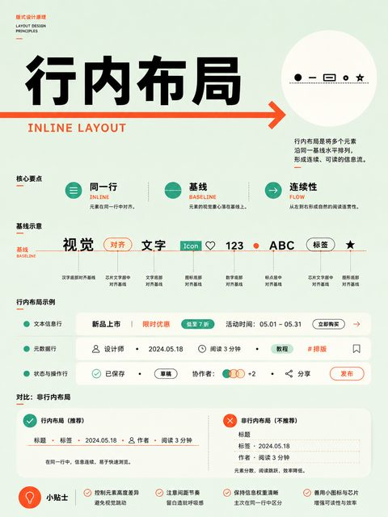</a> |
| :---: | :---: | :---: | :---: |
| **246** 簇群 | **247** 侧栏原语 | **248** 切换器 | **249** 封面原语 |

|  |  |  | <a href="../../v2/images/05-web-ui/253-悬浮层.png">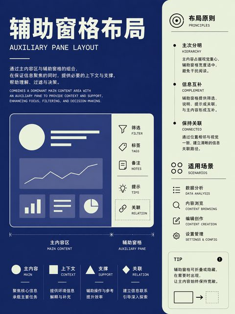</a> |
| :---: | :---: | :---: | :---: |
| **250** 自适应网格原语 | **251** 比例框 | **252** 横向卷轴 | **253** 悬浮层 |

|  |  |  | <a href="../../v2/images/05-web-ui/257-三列页面.png">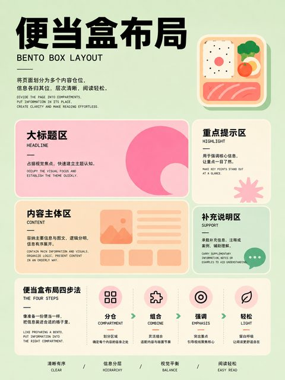</a> |
| :---: | :---: | :---: | :---: |
| **254** 图标文字组合 | **255** 单列页面 | **256** 双列页面 | **257** 三列页面 |

| <a href="../../v2/images/05-web-ui/258-侧边栏页面.png">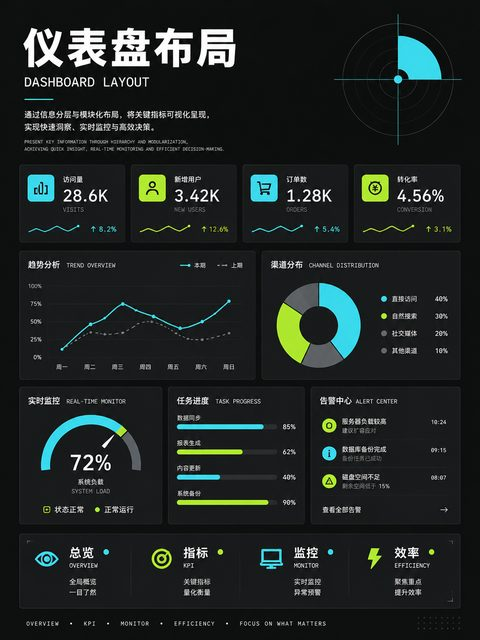</a> | <a href="../../v2/images/05-web-ui/259-分屏布局.png">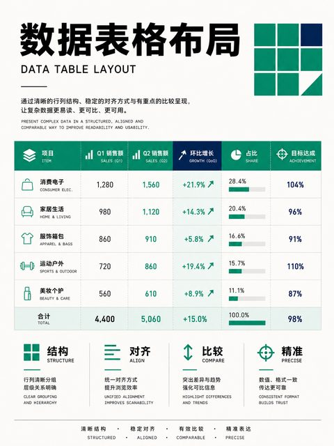</a> | <a href="../../v2/images/05-web-ui/260-圣杯布局.png">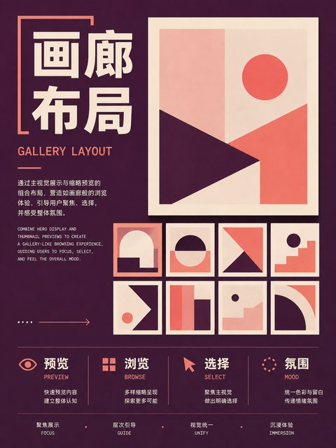</a> |  |
| :---: | :---: | :---: | :---: |
| **258** 侧边栏页面 | **259** 分屏布局 | **260** 圣杯布局 | **261** 页眉—主体—页脚 |

| <a href="../../v2/images/05-web-ui/262-顶部导航布局.png">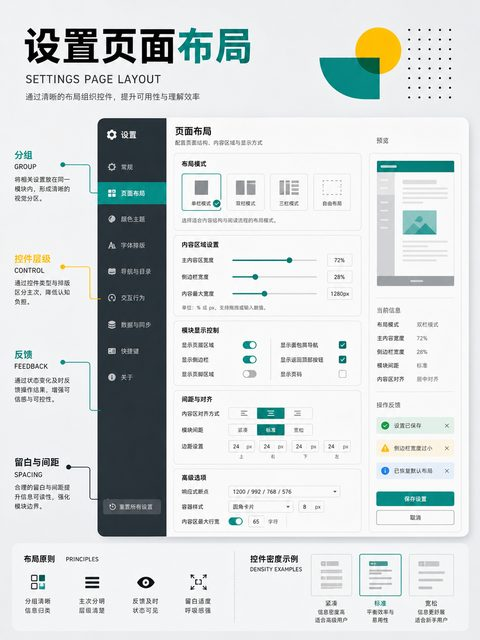</a> |  | <a href="../../v2/images/05-web-ui/264-底部导航布局.png">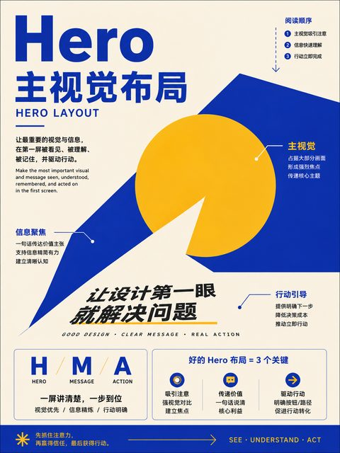</a> | <a href="../../v2/images/05-web-ui/265-标签页布局.png">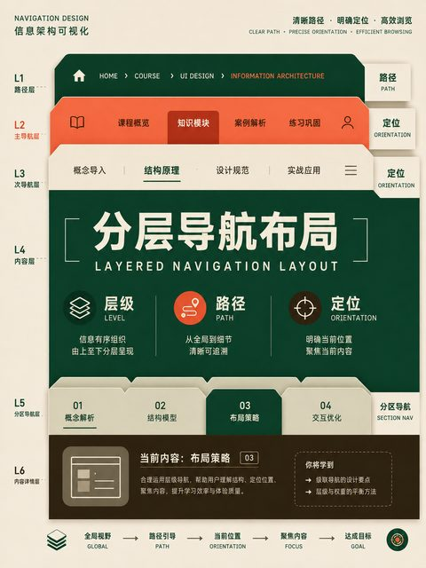</a> |
| :---: | :---: | :---: | :---: |
| **262** 顶部导航布局 | **263** 导航抽屉布局 | **264** 底部导航布局 | **265** 标签页布局 |

| <a href="../../v2/images/05-web-ui/266-手风琴布局.png">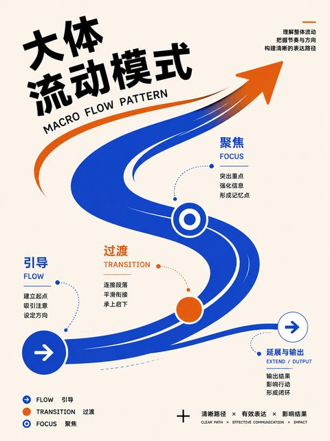</a> |  |  | <a href="../../v2/images/05-web-ui/269-信息流布局.png">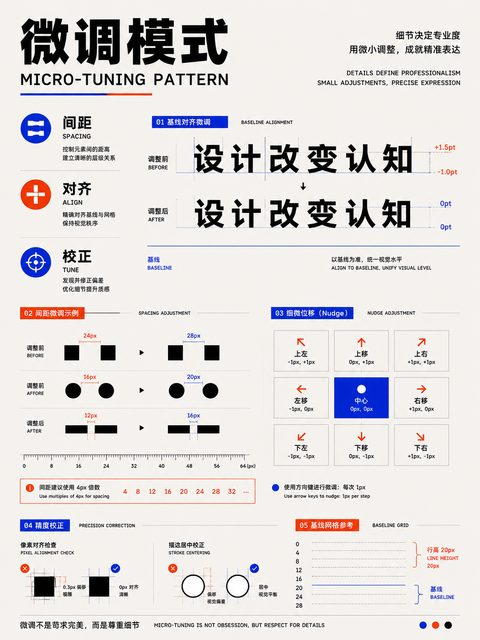</a> |
| :---: | :---: | :---: | :---: |
| **266** 手风琴布局 | **267** 列表—详情布局 | **268** 辅助窗格布局 | **269** 信息流布局 |

|  |  |  |  |
| :---: | :---: | :---: | :---: |
| **270** 卡片网格布局 | **271** 瀑布流页面 | **272** 便当盒布局 | **273** 仪表盘布局 |

| <a href="../../v2/images/05-web-ui/274-数据表格布局.png">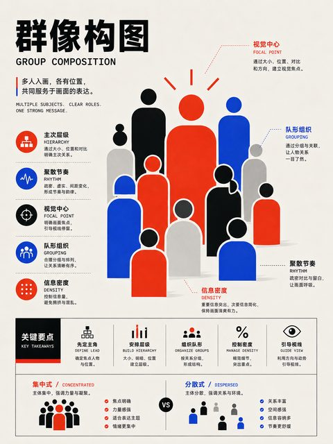</a> |  |  |  |
| :---: | :---: | :---: | :---: |
| **274** 数据表格布局 | **275** 画廊布局 | **276** 轮播布局 | **277** 时间线布局 |

|  |  | <a href="../../v2/images/05-web-ui/280-树形浏览布局.png">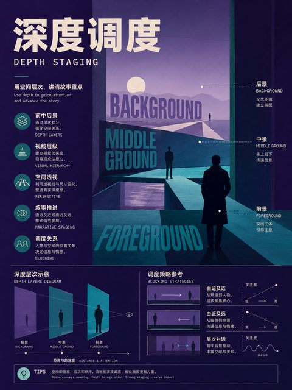</a> |  |
| :---: | :---: | :---: | :---: |
| **278** 看板布局 | **279** 日历布局 | **280** 树形浏览布局 | **281** 对话布局 |

|  | <a href="../../v2/images/05-web-ui/283-画布工作区布局.png">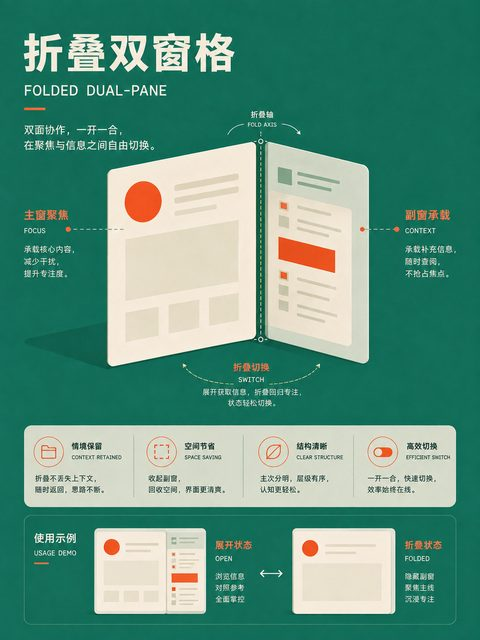</a> |  |  |
| :---: | :---: | :---: | :---: |
| **282** 地图主导布局 | **283** 画布工作区布局 | **284** 表单布局 | **285** 分步表单 |

|  | <a href="../../v2/images/05-web-ui/287-设置页面布局.png">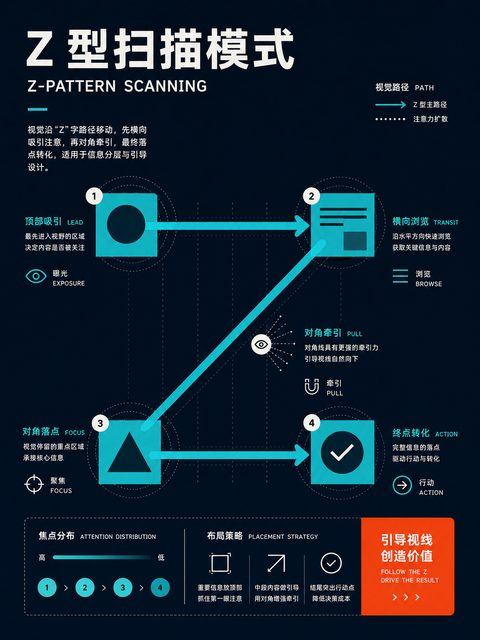</a> |  |  |
| :---: | :---: | :---: | :---: |
| **286** 搜索结果布局 | **287** 设置页面布局 | **288** 媒体对象布局 | **289** Hero 主视觉布局 |

| <a href="../../v2/images/05-web-ui/290-分层导航布局.png">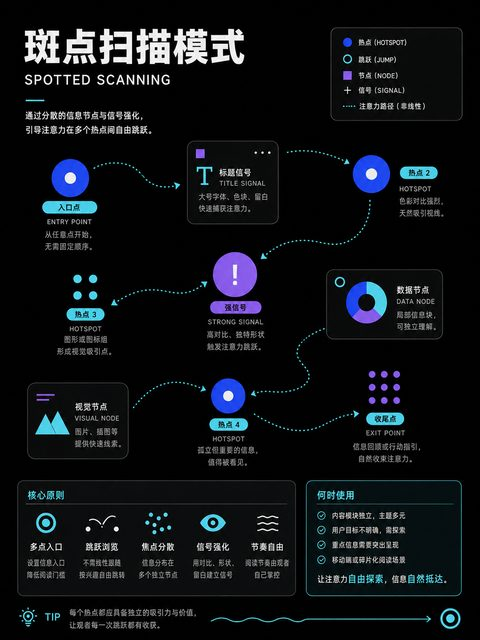</a> |  | <a href="../../v2/images/05-web-ui/292-列下落模式.png">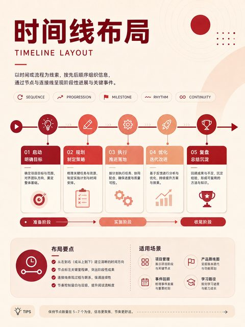</a> |  |
| :---: | :---: | :---: | :---: |
| **290** 分层导航布局 | **291** 大体流动模式 | **292** 列下落模式 | **293** 布局切换模式 |

|  |  |  | <a href="../../v2/images/05-web-ui/297-顺序重排.png">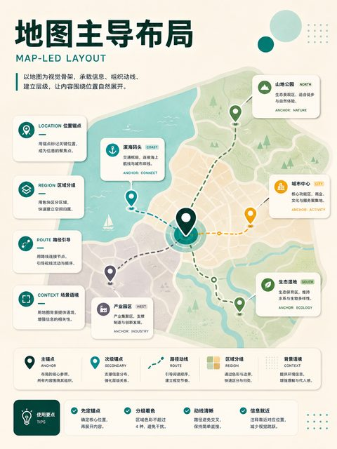</a> |
| :---: | :---: | :---: | :---: |
| **294** 微调模式 | **295** 画布外模式 | **296** 堆叠重排 | **297** 顺序重排 |

| <a href="../../v2/images/05-web-ui/298-折叠双窗格.png">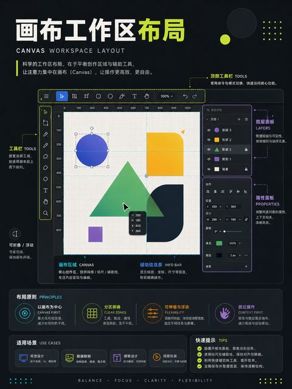</a> |  |  |  |
| :---: | :---: | :---: | :---: |
| **298** 折叠双窗格 | **299** 自适应网格 | **300** 组件级响应布局 |  |
