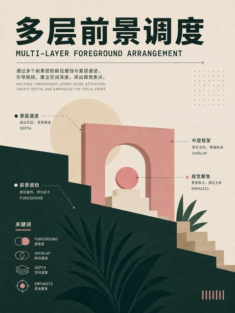
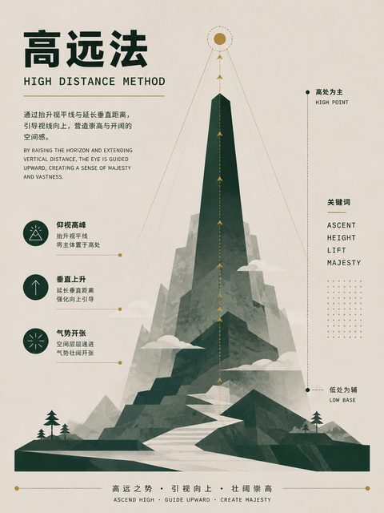

# 影视画面构图 · 14 种

以镜头、景别、机位和画幅关系组织动态影像中的单个画面。

[← 返回 350 种排版总目录](README.md)

**本类主题：** [人物数量与群像](#subject-count) · [视角与镜头覆盖](#viewpoint-coverage) · [场面调度与景深](#blocking-depth)

## 人物数量与群像 · 4 种

单人、双人、三人与群像的画面关系。 `301–304`

|  |  |  |  |
| :---: | :---: | :---: | :---: |
| **301** 单人构图 | **302** 双人构图 | **303** 三人构图 | **304** 群像构图 |

## 视角与镜头覆盖 · 5 种

过肩、主客观视角、净单人和脏单人镜头。 `305–309`

|  |  |  |  |
| :---: | :---: | :---: | :---: |
| **305** 过肩构图 | **306** 主观视角构图 | **307** 客观视角构图 | **308** 净单人镜头 |

|  |  |  |  |
| :---: | :---: | :---: | :---: |
| **309** 脏单人镜头 | &nbsp; | &nbsp; | &nbsp; |

## 场面调度与景深 · 5 种

深度、平面、三角、横向和多层前景调度。 `310–314`

|  |  |  |  |
| :---: | :---: | :---: | :---: |
| **310** 深度调度 | **311** 平面调度 | **312** 三角调度 | **313** 横向调度 |

|  |  |  |  |
| :---: | :---: | :---: | :---: |
| **314** 多层前景调度 | &nbsp; | &nbsp; | &nbsp; |
