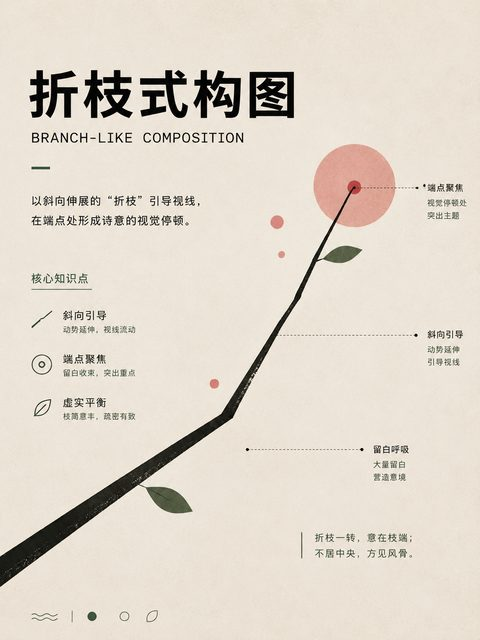
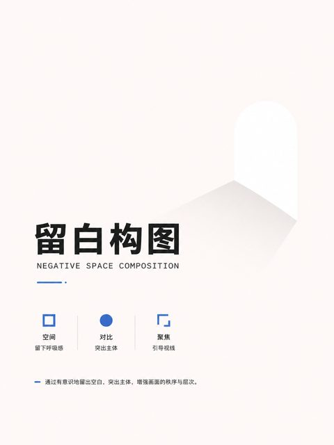
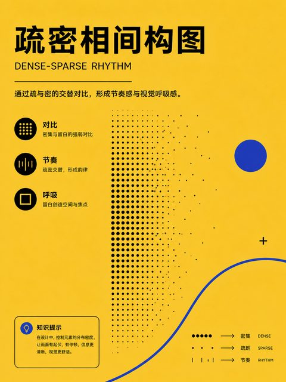
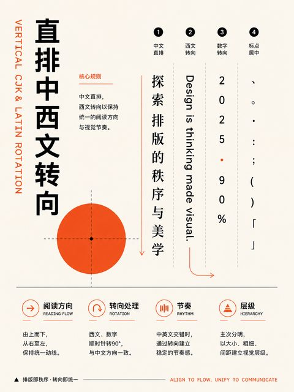
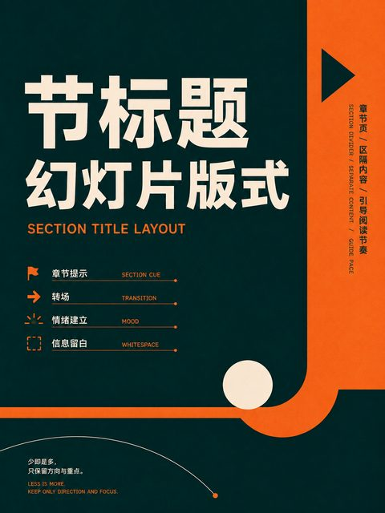
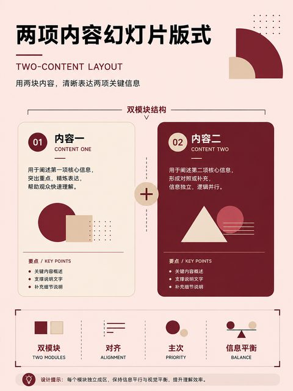
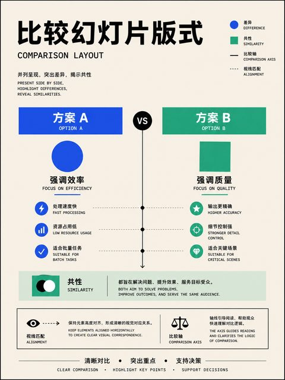

# 中国传统构图 · 20 种

整理中国绘画与传统视觉中的空间经营、散点透视和章法。

[← 返回 350 种排版总目录](README.md)

**本类主题：** [三远、透视与游观](#perspective-roaming) · [取景与景式](#scene-framing) · [留白、虚实与章法](#blank-rhythm)

## 三远、透视与游观 · 6 种

高远、深远、平远、散点透视与游观式构图。 `315–320`

|  |  |  |  |
| :---: | :---: | :---: | :---: |
| **315** 高远法 | **316** 深远法 | **317** 平远法 | **318** 三远综合构图 |

|  |  |  |  |
| :---: | :---: | :---: | :---: |
| **319** 散点透视 | **320** 游观式构图 | &nbsp; | &nbsp; |

## 取景与景式 · 5 种

全景、一河两岸、边角、截景和折枝。 `321–325`

|  |  |  |  |
| :---: | :---: | :---: | :---: |
| **321** 全景式构图 | **322** 一河两岸式 | **323** 边角式构图 | **324** 截景式构图 |

|  |  |  |  |
| :---: | :---: | :---: | :---: |
| **325** 折枝式构图 | &nbsp; | &nbsp; | &nbsp; |

## 留白、虚实与章法 · 9 种

计白当黑、疏密、主宾、开合、藏露与欹正。 `326–334`

|  |  |  |  |
| :---: | :---: | :---: | :---: |
| **326** 留白构图 | **327** 计白当黑构图 | **328** 虚实相生构图 | **329** 疏密相间构图 |

|  |  |  |  |
| :---: | :---: | :---: | :---: |
| **330** 主宾关系构图 | **331** 开合构图 | **332** 起承转合构图 | **333** 藏露关系构图 |

|  |  |  |  |
| :---: | :---: | :---: | :---: |
| **334** 欹正关系构图 | &nbsp; | &nbsp; | &nbsp; |
