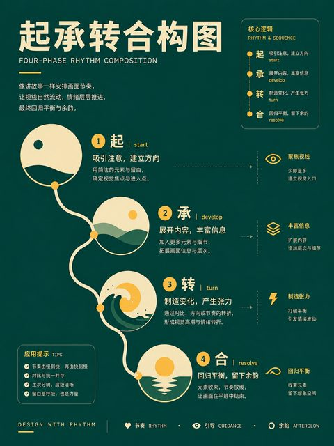
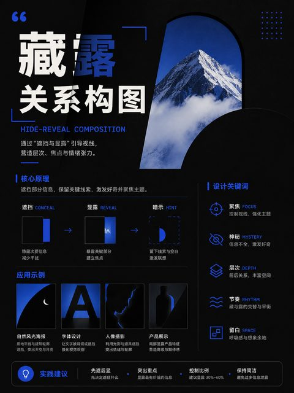
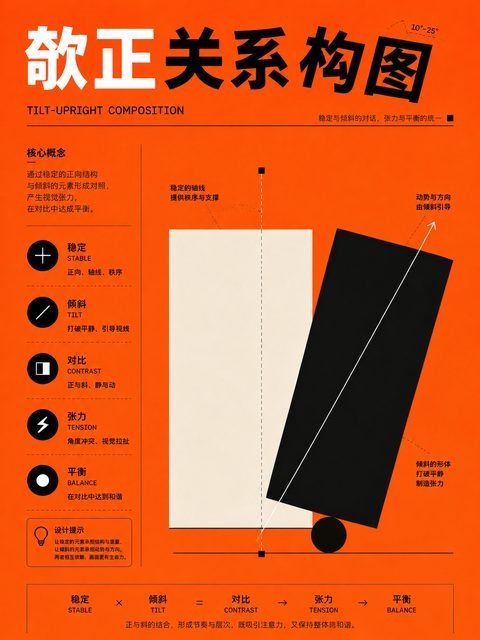
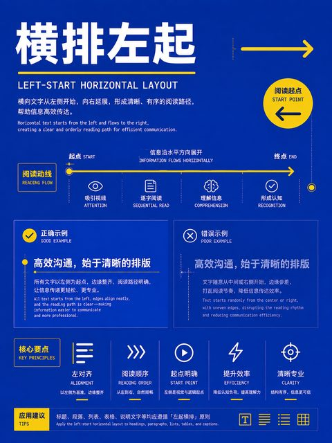
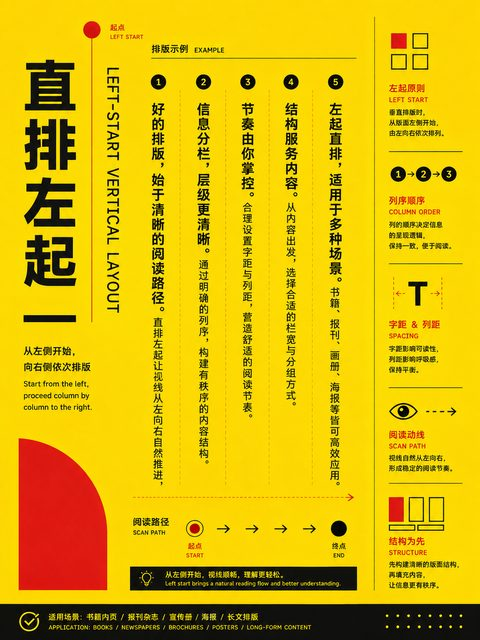
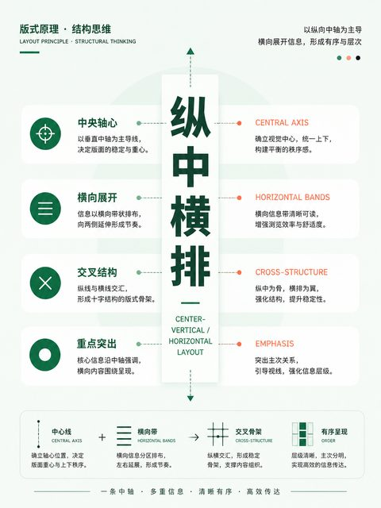

# 演示文稿页面 · 16 种

覆盖封面、目录、内容、比较、数据、流程和全图等幻灯片版式。

[← 返回 350 种排版总目录](README.md)

**本类主题：** [基础幻灯片](#core-slides) · [叙事与数据页面](#story-data-slides)

## 基础幻灯片 · 9 种

标题、章节、内容、比较、空白与图文说明页面。 `335–343`

|  |  |  |  |
| :---: | :---: | :---: | :---: |
| **335** 标题幻灯片幻灯片版式 | **336** 标题和内容幻灯片版式 | **337** 节标题幻灯片版式 | **338** 两项内容幻灯片版式 |

|  |  |  |  |
| :---: | :---: | :---: | :---: |
| **339** 比较幻灯片版式 | **340** 仅标题幻灯片版式 | **341** 空白幻灯片版式 | **342** 内容与标题说明幻灯片版式 |

|  |  |  |  |
| :---: | :---: | :---: | :---: |
| **343** 图片与标题说明幻灯片版式 |  |  |  |

## 叙事与数据页面 · 7 种

大数字、引语、时间线、流程、矩阵、图表和全图。 `344–350`

|  |  |  |  |
| :---: | :---: | :---: | :---: |
| **344** 大数字页幻灯片版式 | **345** 引语页幻灯片版式 | **346** 时间线页幻灯片版式 | **347** 流程页幻灯片版式 |

|  |  |  |  |
| :---: | :---: | :---: | :---: |
| **348** 矩阵页幻灯片版式 | **349** 数据图表页幻灯片版式 | **350** 全图页幻灯片版式 |  |
